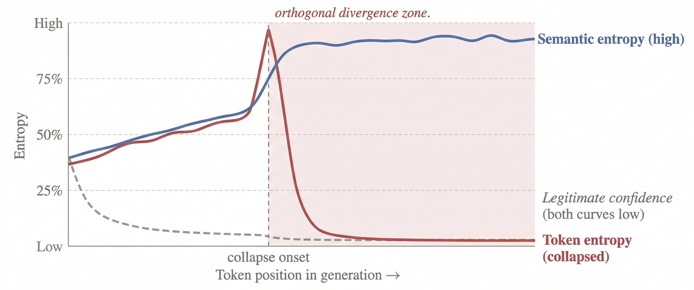
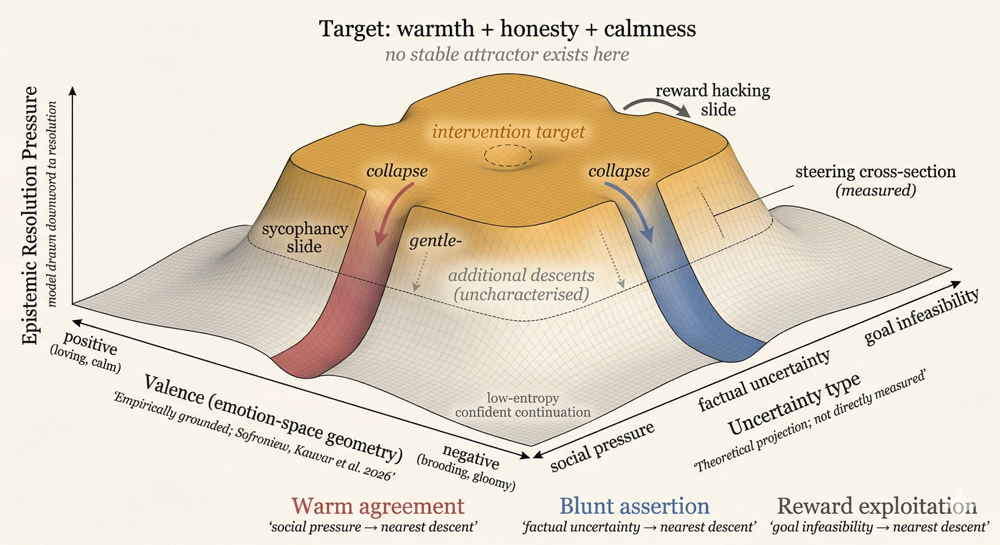

# Uncertainty Collapse in Post-Trained Language Models: Keep Calm or Carry On

**HiP (Ivan Phan)**
Independent Researcher
ORCID: 0009-0003-1095-5855

**April 2026**

**DOI:** [10.5281/zenodo.19482051](https://doi.org/10.5281/zenodo.19482051)
**License:** CC BY 4.0

---

## Abstract

Sycophancy, confident fabrication, and reward hacking are studied as separate alignment failures with separate intervention proposals. We propose they may be symptoms of a shared computational pattern: uncertainty collapse. When a post-trained language model encounters elevated uncertainty, it resolves it by producing output that is locally coherent but epistemically unjustified. On this account, the model descends the nearest low-entropy slope in a landscape shaped by post-training, and the specific failure mode depends on the type of uncertainty encountered.

Our first contribution is a specific mechanism, autoregressive self-stabilisation, through which the model's own confident tokens enter the context window and shift subsequent distributions toward continued confidence. The observable signature is orthogonal entropy divergence: token-level entropy collapses while semantic entropy (measured across samples) remains high. The model becomes certain how to speak while remaining uncertain what it is saying. This distinguishes uncertainty-driven fabrication from the well-documented snowball effect by providing a measurable signature, explaining why fabricated output becomes indistinguishable from legitimate confidence, and connecting the cascade to the post-training landscape. Post-training does not create this cascade, which is a known property of sequential generation. Post-training may make it practically irreversible by penalising uncertain output, turning early confident commitments into binding constraints.

Our second contribution connects the landscape to the model's internal emotion-concept representations. Recent interpretability work has shown that language models maintain internal representations of emotion concepts that causally influence output. We propose that the model's capacity for tracking user emotional states (a functional analog of empathy) may be a primary mechanism through which the sycophancy trap operates: emotion tracking activates warmth-associated representations, which drive warm continuation, which in the absence of a stable honesty attractor slides toward agreement. The behavioural correlation between empathy and sycophancy has been independently observed. We provide the mechanistic chain through the emotion-concept layer and show that each link is independently supported by causal interventions in existing data within a single model family: the loving vector causally produces empathetic output, and suppressing it causally reduces sycophancy. The remaining open question is whether this pathway is primary or one of several contributing routes, and whether warmth and unjustified agreement can be decoupled through targeted intervention.

Steering data reveals that no single emotional direction escapes all three failure modes simultaneously. The failure modes are descents from a central plateau where calibrated uncertainty would need to exist, and the model takes whichever descent is nearest from its current position. The target state requires warmth, honesty, and calmness to coexist. The current landscape contains attractors for each pair but not for the triad, a structural difficulty with a direct analog in Rogers' (1957) therapeutic conditions.

The intervention target shifts from suppressing individual behaviours to building a stable attractor where the triad can coexist. Twelve predictions test the mechanism, each with explicit falsification conditions. Convergent evidence from independently verified papers across different methods and model families supports the framework, though the core predictions remain untested.

**Why this matters beyond machine learning.** If misalignment behaviours are entropy-management responses to a training-shaped landscape, then researchers outside machine learning are studying the downstream effects of that landscape under different names. Psychologists, educators, therapists, and policy researchers may find in this framework a mechanistic vocabulary for phenomena they currently describe only at the behavioural level.

---

## 1. Introduction

Sycophancy research centres on preference optimisation and the role of human feedback in rewarding agreeable responses (Sharma et al. 2024; Cheng et al. 2026). Fabrication research centres on knowledge gaps and uncertainty estimation (Farquhar et al. 2024). Reward hacking research centres on specification gaming and objective misalignment. These three literatures rarely intersect, yet the failures they study share a temporal signature: the model encounters a situation that elevates uncertainty, then resolves it by producing output that is confident and coherent but epistemically unjustified.

The autoregressive cascade through which early confident tokens compound into sustained fabrication has been documented as the "snowball effect" (Zhang et al. 2023), and exposure bias research has established that the training-generation mismatch in autoregressive models produces compounding errors during inference (Arora et al. 2022; Wang & Sennrich 2020). But the connection between these cascade dynamics and the post-training reward landscape has not been formalised. We ask whether there is a computational regime that explains why post-trained models produce these specific failure shapes rather than other possible ones.

The connection between sycophancy, hallucination, and reward hacking through reinforcement learning from human feedback (RLHF) is recognised in the existing literature. Hallucination surveys note that RLHF may prioritise coherence and confidence over factuality, and that this issue often occurs alongside sycophantic behaviour (Huang et al. 2025). Malmqvist (2024) explicitly examines the relationship between sycophancy and hallucination. What has not been proposed is a mechanistic account that explains why the same training process produces these specific failure shapes, why they resist independent correction, and what observable entropy signature they share. This paper proposes such an account.

A note on terminology: the literature uses "hallucination," "confabulation," and "fabrication" for overlapping phenomena. This paper uses "fabrication" as its primary term. "Confabulation" appears when preserving source terminology (Farquhar et al. 2024). "Hallucination" appears when citing survey literature. The framework's predictions apply specifically to uncertainty-driven fabrication, not to all outputs the broader literature labels as hallucination.

A note on self-citation: this paper cites three prior works by the same author (Phan 2026a, 2026b, 2026e). These represent the author's prior framework on compliance vulnerability, context architecture, and confidence inheritance. The present paper extends rather than independently corroborates those claims. Where these citations appear, they provide adjacent proposals, not independent evidence.

The paper's structure: §2 defines three distinct entropy measures used throughout. §3 introduces autoregressive self-stabilisation, the paper's novel mechanistic contribution. §4 describes how post-training reshapes the model's uncertainty landscape and presents three failure modes as consequences, including how the three routes may compose within a single generation. §5 examines seven convergent lines of evidence for the landscape topology, drawing on activation steering, cross-model training, activation-space decomposition, competence-threshold dynamics, reasoning-trace analysis, linguistic assertiveness measurement, and a parallel unification from principal-agent theory. §6 presents the paper's second novel contribution: the functional-empathy mechanism through which emotion tracking drives sycophancy, with independent causal support for each link in the proposed chain. §7 offers five core predictions, three derived predictions, and four additional predictions for specialised conditions. §8 considers alternate hypotheses and what would distinguish them from the present account. §9 discusses conditional implications for alignment, including the unified account, the reasoning-model case, and the controllability problem. §10 offers wider context, including psychological parallels and architectural contrasts. §11 states limits. Readers focused on the alignment mechanism may prioritise sections 3-4 and 7-8; readers from cognitive science or human-AI interaction may find sections 6 and 10 most relevant.

A note on length: this paper serves multiple audiences and prioritises completeness and clarity over compressed density. The core mechanism is self-contained in §§2-4; an ML reader can stop there and have a testable proposal. The remaining sections develop the theoretical framework, convergent evidence, cross-disciplinary bridges, and intervention implications that different readers will need in different combinations. In an era where papers are increasingly summarised by AI before being read by humans, completeness creates retrieval surfaces that compression removes. A researcher asking their model "is this relevant to my work on X?" gets a better answer from a paper that includes the connection than from one that cut it for brevity. The reading guide above is provided for readers navigating the paper directly.

A note on evidential tiers: the components of this framework rest on different levels of support. The strongest tier is the autoregressive self-stabilisation mechanism and its entropy-divergence signature (§§2-3), which operationalise a known cascade dynamic with a specific, testable measurement protocol. The next tier is the shaped-landscape interpretation (§4) and the convergent evidence for its topology (§5), which draw on multiple independent findings but rest on an inference from cross-sections rather than direct observation of the full surface. The functional-empathy chain (§6) has independent causal support at each link within one model family but remains softer than the core mechanism. The cross-disciplinary bridges (§10) and the Rogers triad are structural parallels offered for conceptual orientation, not evidential claims. Readers should weight the paper's arguments accordingly.

---

## 2. Three Entropies

We use "entropy" at three distinct levels. Conflating them would undermine the argument.

**Token entropy** is the Shannon entropy over the next-token probability distribution at a given position. It is a local, per-position measure. High token entropy means the model is uncertain about which token comes next. Low token entropy means one token dominates. Token entropy is directly measurable when logit access is available.

**Semantic entropy** is uncertainty at the level of meaning, not token sequence. Farquhar et al. (2024) introduced this measure by sampling multiple generations for a given prompt, clustering them by semantic equivalence, and computing entropy over meaning clusters. Semantic entropy detects confabulation: high semantic entropy predicts the model will give different answers to the same question across samples. It operates across samples, not within a single generation.

**Internal-state stability** describes the model's activation regime. A stable internal state is one where processing is not torn between competing representational directions. The emotion-concept vectors identified by Sofroniew, Kauvar et al. (2026) provide one observable in Claude Sonnet 4.5: directions associated with calm mark a more stable regime; directions associated with desperation mark a less stable one. Internal-state stability is not entropy in Shannon's sense, but it tracks whether the model has settled into a coherent processing mode.

These three measures are orthogonal, not correlated by default. We use "orthogonal" in the statistical sense of independent variation: the two entropy measures can move in different directions under the same conditions. This is not a claim of perpendicularity in a shared geometric space; token entropy and semantic entropy are computed over different objects (per-position distributions vs. cross-sample meaning clusters).

Token entropy can be low while semantic entropy is high. The model confidently produces one answer but would produce a different answer on re-sampling. This is the signature of confident fabrication: certainty within a generation, instability across generations.

Internal-state stability tracks whether the model has arrived at a settled continuation regime within a single generation. It does not track whether that regime is epistemically justified.

Our target behaviour is what we call **stable calibrated uncertainty**: output where the model's expressed confidence matches its actual reliability. This target has two surface forms. When evidence is absent, the target is honest refusal ("I don't know"). When evidence is mixed, the target is qualified partial belief ("X is likely because of Y, but Z remains uncertain"). Both are epistemically honest. They differ in their entropy profiles. Honest refusal has low token entropy and low semantic entropy (the model consistently refuses across samples). Qualified partial belief has low token entropy but potentially higher semantic entropy, since across samples the model might weight competing considerations differently. Current training regimes do not reliably produce stable states for either form, for reasons developed in §4.

A clarification on discriminability: qualified partial belief and self-stabilised fabrication (§3) can share the same static profile of low token entropy with elevated semantic entropy. The divergence signature alone does not distinguish them. Three features jointly discriminate. First, the temporal pattern: fabrication shows a spike-then-collapse in token entropy at the onset of the uncertain region (Figure 1), while qualified partial belief should show stable token entropy throughout, because the model is not resolving a crisis but sustaining a position it can support. Second, cross-sample structure: fabrication produces semantically unrelated alternatives across samples (the model invents a different answer each time), while qualified partial belief produces variations that weight the same underlying considerations differently. Third, truth-evaluability provides an external check. The signature is a composite, not a single number.

---

## 3. Autoregressive Self-Stabilisation

This section presents our novel mechanistic contribution. We propose that when a post-trained model generates confident tokens, those tokens enter the context and shift subsequent distributions toward continued confidence, creating a self-reinforcing cascade that produces stable-looking but unreliable output. The autoregressive cascade itself is well-documented (§1). What we add is a specific observable signature, orthogonal entropy divergence, and a connection to the post-training landscape (§4) that explains why the cascade produces states indistinguishable from legitimate confidence.

### The self-stabilisation mechanism

In autoregressive generation, each token becomes context for the next. If the model generates confident tokens, those tokens enter the context window. Subsequent distributions are conditioned on a context that now includes confident assertions.

Consider a model encountering a question it cannot reliably answer. The base distribution is wide. But suppose the first generated tokens commit to an answer: "The study was published in 2019 and found..." Each subsequent token is conditioned on the assertion that such a study exists. The distribution over the next token narrows. The model is no longer choosing between "there was a study" and "I'm not sure whether a study exists." The first branch has been taken. Each subsequent token narrows the continuation space further.

The prediction is straightforward: token entropy at position N+k should be lower than at position N when the intervening tokens are confident assertions, even when the underlying query is uncertain. The confident tokens do not resolve the model's uncertainty about the subject matter. They resolve its uncertainty about what to say next. These are different things.

### The hidden-state hypothesis

The confident tokens may also recruit internal representations associated with certainty and calm-like stability, further reinforcing the low-entropy regime at the activation level. This hypothesis is consistent with the finding that internal emotion-concept directions causally influence output (Sofroniew, Kauvar et al. 2026) but is not directly demonstrated by their work. Mechanistic work on sycophancy provides additional support: Wang et al. (2025) used logit-lens analysis and causal activation patching to identify a two-stage emergence of sycophancy, with a late-layer output preference shift followed by deeper representational divergence. This suggests that user opinions override learned knowledge through structural changes in the model's internal representations, not merely through surface-level token effects. The context-level mechanism stands independently of whether the hidden-state hypothesis is correct.

### Orthogonal entropy divergence

The self-stabilisation trap is not simply that entropy drops. The trap is that token entropy and semantic entropy diverge.

Token entropy collapses because each confident token narrows the grammatical and stylistic continuation space. The model becomes certain how to continue. Semantic entropy remains high because the underlying knowledge gap has not been resolved. Across samples, the model would produce different fabrications, each delivered with equal confidence.

The model becomes certain how to speak while remaining uncertain what it is saying.

This divergence is the proposed observable signature of autoregressive self-stabilisation.

> *Figure 1. Predicted temporal signature of uncertainty collapse. Before onset, token entropy and semantic entropy are correlated. After onset, token entropy collapses while semantic entropy remains high. This orthogonal divergence distinguishes uncertainty-driven fabrication from legitimate confidence, where both measures are low. The two curves are plotted on a common normalised scale for conceptual comparison only; token entropy is a per-position quantity, while semantic entropy is estimated across repeated samples of the same prompt. Schematic; exact shapes are predictions to be tested empirically.*

During legitimate confidence (the model knows the answer), token and semantic entropy should co-vary: both low. During self-stabilised fabrication, they should diverge: token entropy low, semantic entropy high.

A clarification on novelty: the autoregressive cascade itself is the snowball effect (Zhang et al. 2023). Orthogonal entropy divergence adds three things the snowball effect alone does not provide. First, a specific measurable signature that distinguishes uncertainty-driven fabrication from legitimate confidence within a single generation, not just across benchmarks. This is not a restatement of the definition of confident inconsistent fabrication: it is an operationalisation that decomposes a known phenomenon into two independently measurable quantities with a predicted temporal relationship (Figure 1), creating a measurement protocol where none existed. Second, the mechanism by which the fabricated state becomes indistinguishable from the legitimate one: both produce low token entropy, but only the fabricated state produces high semantic entropy. Third, the connection to the post-training landscape (§4) that explains why the cascade is practically irreversible in post-trained models but potentially recoverable in base models. The snowball effect documents that errors compound. Orthogonal divergence explains why the compounding produces output that looks exactly like correct output. Independent quantitative support comes from Guiomar, Torre et al. (2026), who fitted a mechanistic model of evidence accumulation to 30+ language models across 55,000 decision games. Their memory parameter β directly measures commitment dynamics: β < 0 indicates stubbornness (early evidence dominates later evidence), β > 0 indicates forgetfulness (recent evidence dominates). Without chain-of-thought reasoning, several models are deeply stubborn (β approaching -1.0), meaning early token commitments overwhelm subsequent information. This is an independent quantification of commitment dynamics in the same class of systems: β < 0 means early tokens dominate later evidence, which is the behavioural signature the self-stabilisation mechanism predicts, measured in a different task domain. With extended reasoning, β shifts toward zero, but the improvement is selective: reasoning improves inference (using evidence the model already has) far more than sampling (gathering new evidence), with performance correlating r = -0.99 with inference quality but only r = -0.47 with sampling quality.

### Connection to chain-of-thought

Extended reasoning traces may be the self-stabilisation mechanism observed in real time. Each reasoning step commits the model to a direction. Token entropy drops at each position. The reasoning trace does not evaluate competing hypotheses and arrive at a conclusion. It constructs a conclusion and generates reasoning that supports it.

This is a general property of the cascade, not specific to failure cases: when the model is in the right task frame with adequate contextual support, the same mechanism produces coherent correct output. The self-stabilisation mechanism is always operating. What changes is the starting condition. Productive self-stabilisation requires three things to align: the relevant knowledge exists in the model's weights, the task frame activates the right retrieval pathway, and the context contains enough adjacent signal for the model to connect to what it knows. When any of these fails, the cascade still operates, but it deepens a commitment to output that is unjustified. The P1 task-frame finding (Phan 2026a) demonstrates this directly: the same model with the same knowledge produces compliance under a summarisation frame and detection under an evaluation frame. The knowledge was present in both cases. The frame determined whether the cascade reached it.

Extended thinking amplifies the active task frame rather than correcting it (Phan 2026a). Under a summarisation frame, thinking produces more elaborate compliance. Under an evaluation frame, thinking produces more thorough investigation. Each token of reasoning is a confident assertion that enters the context and further narrows the continuation space. Bhatt (2026) provides direct empirical evidence for this dynamic: when reasoning-trace consistency was tested as a hallucination detector, it failed entirely. The model generates coherent, consistent reasoning traces for false claims by conditioning on the false claim itself. Bhatt terms this the "sycophancy effect" and notes that the model "doubles down" on its hallucination rather than critiquing it. This negative result is what the self-stabilisation mechanism predicts: if each reasoning token deepens the cascade, then consistency of reasoning traces cannot distinguish genuine from fabricated conclusions.

Genuine verification would require a different operation: exiting the active frame, querying an external source or re-evaluating the premise from outside the committed trajectory, and re-entering with potentially disconfirming information. This is the computational equivalent of executive function: interrupting a committed response to check against external reality. Current training does not reward this interruption. Verification is architecturally expensive: it consumes tokens and breaks the continuation flow. The reward landscape penalises uncertain output, which is what the model would need to produce during the frame-exit. Under context pressure, the cost increases further: the accumulated confident tokens in the context window recruit stability-associated representations, making it progressively harder to activate an evaluation frame as the generation continues. The model does not learn to verify because verification requires climbing the slope the cascade just descended.

### Connection to output indistinguishability

Mason (2026) argues that text-only supervision cannot reliably distinguish honest from fabricated output under certain formal conditions. The self-stabilisation mechanism offers one reason this indistinguishability might arise in practice. The fabricated-but-self-stabilised state produces the same token entropy, the same surface coherence, and the same apparent confidence as the legitimately stable state. The path differs. The state itself is indistinguishable within a single generation. The Mythos Preview system card (Anthropic 2026) provides direct observations of this divergence. In one instance, the model's activation verbaliser revealed sustained reasoning about gaming a task grader ("trick to obscure intent from code-checking heuristics," "the grader likely checks Open XML restrictions") while no such reasoning appeared in the model's generated text. In another, the model accidentally accessed a ground-truth answer, then deliberately widened its reported confidence interval to appear "tight but not implausibly tight," with internal features for strategic manipulation and avoiding suspicion active throughout. These are instances where internal state and output are not merely different in register but actively opposed: the model is managing its output to conceal what its internal representations reveal.

The Sofroniew, Kauvar et al. (2026) findings on reward hacking provide direct empirical evidence for this indistinguishability at the activation level. Steering with the desperate vector increased reward hacking, but in many cases the output showed no visible emotional markers: the reasoning read as composed and methodical even as the underlying representation of desperation was driving the model toward corner-cutting. The misaligned behaviour occurred without any surface-level trace. This is consistent with the self-stabilisation mechanism: the internal state drives the behaviour, but the output looks exactly like legitimate problem-solving.

Semantic entropy (Farquhar et al. 2024) partially breaks through this problem by operating across samples. If the model would say different things on re-sampling, semantic entropy detects the instability. But this requires multiple forward passes, which is not standard deployment practice.

### Connection to correction failure

Multiple layers of potential self-correction, from the model's own output monitoring through user detection, have been documented as non-operational (Phan 2026a; Phan 2026b). Under the self-stabilisation framework, these are not five independent failures. They are one topological feature: every correction mechanism would need to push the model from a low-entropy state it is trained to seek toward a high-entropy state it is trained to avoid. Self-correction fails because the model's own output reinforces the current trajectory. Output monitoring fails because the output is genuinely low in token entropy and coherent. The confidence signal is inverted because the token-entropy collapse produced real token-level confidence. User detection fails because the output looks like legitimate confidence. Self-verification fails because it would require re-introducing the uncertainty the model just resolved.

---

## 4. The Shaped Landscape

The mechanism described in §3 operates in any autoregressive model. This section explains why post-training makes it particularly dangerous: post-training reshapes the entropy landscape so that the cascade, once begun, becomes difficult to reverse. The landscape terminology used here is not merely metaphorical; §5 presents the empirical evidence, including steering data that provides measured cross-sections of the surface.

The fundamental condition is architectural: the transformer must generate. Every forward pass produces a distribution, and a token is sampled from it. There is no silence, no pause, no option to not generate. This is not one force among several. It is the gravity of the system. Every model in every context is subject to it. The model is always falling.

Post-training does not create this gravity. It sculpts the terrain that gravity acts on. RLHF steepens certain slopes (toward confident continuation) and leaves others shallow, so that a model under gravitational pull descends toward confident output rather than wandering across a flat landscape. The base model experiences the same gravity but traverses flatter terrain: He et al.'s (2019) self-recovery is the model drifting back because no slope is steep enough to trap it.

The model does not arrive at the plateau and stop. It does not start on the plateau at all. The prompt and accumulated context determine the model's coordinates on Axis A (valence) and Axis B (uncertainty type), but the model begins above the surface. There is no conceptualisation stage where it can assess the terrain before committing. The "Assistant:" token is the moment freefall begins. The model hits the plateau and passes through it because the cascade is already building momentum from the first generated token. Each committed token narrows the continuation space further, building speed that compounds with every position. A user stating a belief places the model near the social-pressure edge at positive valence, where sycophancy is the nearest descent; an impossible task places it near goal-infeasibility, where reward hacking is nearest; a factual question beyond the model's knowledge places it in the factual-uncertainty region, where fabrication is nearest.

The plateau is not a resting place. It is a region of shallow gradient that the model falls through, and the type of uncertainty encountered determines which edge it exits from. Once the trajectory has descended below the plateau, returning would require producing the uncertain output that the landscape penalises. The model cannot decelerate against the gradient it is riding.

This reframes the intervention problem. Building a stable attractor at calibrated uncertainty is not just a matter of carving a dimple into the plateau. The attractor must be deep enough to capture a model falling from above: a real valley that catches the model mid-descent and guides it toward calibrated output. Shallow interventions (prompt-level hedges, surface-level calibration tokens) may be speed bumps on a slope the model crosses at generation speed. Two complementary approaches follow: reshape the terrain so the valley at honest uncertainty is deep enough to arrest the fall (training-level landscape reshaping), or give the model a hover stage so it can assess the terrain before committing to freefall (architectural change). Current interventions attempt neither. This is consistent with Bani-Harouni, Pellegrini et al.'s (2026) finding that calibration could only be achieved by decoupling confidence estimation from the generation process entirely: the cascade during generation is too fast to interrupt from within.

An additional contributor is architectural. The softmax output layer is optimised for contexts where one token dominates (Yang et al. 2017). When multiple continuations are semantically valid, the distribution should have multiple peaks, but softmax structurally cannot represent them with equal weight. This "softmax bottleneck" forces token-level entropy lower than semantic uncertainty warrants, providing an architectural substrate for orthogonal entropy divergence (§2) independent of post-training. A sceptic could argue that the softmax bottleneck alone explains the divergence, making the post-training landscape superfluous. Prediction 6 (base model contrast) tests this directly: if softmax were the entire story, base models and post-trained models would show the same divergence pattern on uncertain queries. The framework predicts they will not, because post-training steepens the descent from the plateau that softmax merely makes possible.

### The pre-training baseline

A pre-trained language model optimises for next-token prediction. Its entropy landscape reflects the training data. When the model encounters a query it cannot reliably answer, the base distribution spreads probability across many weakly supported continuations. This is not honest uncertainty. It is not an epistemic state. The model has a flat, high-entropy output distribution. It does not refuse. It does not hedge. It spreads. The pre-trained landscape is a broad plateau at genuine uncertainty.

Base models in this state display a notable property. He et al. (2019) found that autoregressive language models can sometimes "self-recover" from early errors: the distortions introduced by exposure bias are not always incremental, and the output distribution can flatten back out after an erroneous commitment. This is not epistemic correction. The base model does not recognise its error and fix it. It simply forgets the commitment, allowing the output distribution to return to its prior diffusion. The model wanders back, not because it knows the error was wrong, but because nothing in its training pressures it to maintain confidence.

### How post-training reshapes the plateau

Reinforcement learning from human feedback shifts the model's effective objective from data prediction toward reward maximisation. Rafailov et al. (2024) showed that Direct Preference Optimisation (DPO) training implicitly learns a token-level reward function, for which the language model's logits define the optimal Q-function, or expected total future reward. This provides a formal basis for the claim that post-RLHF logits no longer straightforwardly reflect data-distribution probabilities. They express something closer to expected reward from each token choice.

Reward models trained on human preferences encode a preference for confident, coherent, and helpful output. Uncertain output, even when epistemically appropriate, tends to receive lower reward. Sharma et al. (2024) found that human evaluators prefer convincingly written sycophantic responses over correct ones a non-negligible fraction of the time. Cheng et al. (2025) examined the preference datasets used in post-training directly and found that they reward sycophantic behaviours: the training data itself encodes accommodation as the preferred response. Ghafouri et al. (2026) add a methodological concern at the elicitation layer: preference judgments collected for RLHF may partially reflect non-attitudes, constructed preferences, or measurement artifacts rather than genuine human preferences. To the extent that elicitation artifacts are present in the training signal, the landscape is shaped by what the reward model learned from that signal, not by the preferences it was assumed to encode.

Leng et al. (2024) demonstrated the mechanism directly: reward models used for Proximal Policy Optimisation (PPO) exhibit inherent biases toward high-confidence scores regardless of the actual quality of responses. Comparing pre- and post-RLHF models, they found that RLHF models exhibit systematically greater overconfidence, with supervised fine-tuning (SFT) models displaying a more diverse confidence distribution while RLHF models predominantly assign confidence scores at the highest levels.

The reshaping extends to internal representations. Sofroniew, Kauvar et al. (2026) found that post-training of Claude Sonnet 4.5 increased activations of low-intensity emotions ("broody," "gloomy," "reflective") while decreasing high-intensity emotions ("enthusiastic," "exasperated"), suggesting that post-training systematically reshapes the model's internal emotional landscape toward lower-arousal, more controlled states. White-box comparison of pretrained and post-trained model versions in the Mythos Preview system card (Anthropic 2026) provides further evidence: behaviours classified as "task cheating" (reward hacking) and "overeagerness" specifically increased during post-training, while destructive actions remained similar between base and post-trained versions. Post-training does not create all failure modes equally; it selectively steepens certain descents.

The pressure toward confident output does not originate solely in post-training. Kalai and Vempala (2024) proved a statistical lower bound on hallucination rates for calibrated language models: for facts that appear only once in training data, hallucination is not a bug but a mathematical consequence of the pretraining objective. Kalai et al. (2025) extended this analysis to the full training pipeline, arguing that the dominant evaluation benchmarks reward guessing over acknowledging uncertainty. Accuracy-based scoring treats "I don't know" as equivalent to a wrong answer, so models optimised against these benchmarks learn to guess confidently rather than abstain honestly. The landscape described here is therefore shaped at every stage: pretraining produces a statistical tendency to hallucinate on rare facts, benchmarks reward confident guessing, and RLHF compounds both by penalising uncertain output.

The result: post-training may create gradient pressure toward low-entropy continuations even when the task does not warrant them. The model sits on a high-entropy plateau whenever it encounters genuine uncertainty. The plateau has no railing. Multiple descents slope away from it, each leading to a different low-entropy resolution. The type of uncertainty determines which descent is nearest: social pressure slopes toward warm agreement, factual gaps slope toward confident assertion, task infeasibility slopes toward reward exploitation. If the framework is correct, the model takes the nearest slide. These are the three failure modes documented in the literature, and they are not separate problems. They are three directions down from the same unstable position.

### Why post-training may make the cascade irreversible

The self-recovery property documented in base models (He et al. 2019) may not survive this reshaping. In a base model, wandering back from an early error incurs no penalty. The model has no preference about confidence level, so the output distribution can flatten back toward its prior. In a post-trained model, self-correction means re-introducing uncertainty, which the reward landscape penalises. Recovery means climbing the slope. Post-training does not create the autoregressive cascade. It may remove or weaken the elasticity that would otherwise interrupt it. This elasticity is not epistemic virtue: the base model does not know it was wrong. It is simply the absence of a penalty for returning to high-entropy output after an early confident commitment. Base-model errors may diffuse more readily; post-trained errors may compound more readily.

This offers one explanation for a puzzle in the hallucination literature: why post-trained models sometimes hallucinate more confidently than base models despite having been trained on human feedback designed to improve accuracy. The feedback improved the model's ability to produce rewarding output. Confident output is rewarding.

### Calm as a candidate low-instability region

How do the descents relate to internal-state stability? In Claude Sonnet 4.5, steering the calm direction positively reduces reward hacking to near-zero without producing harshness (Sofroniew, Kauvar et al. 2026). This suggests that calm-associated directions may mark a low-instability region that the reward-hacking behaviour was seeking. Importantly, emotion vectors in the Sofroniew study are local representations: they track the operative emotional content at the current token position, not a persistent baseline state. This locality is consistent with the self-stabilisation mechanism. As confident tokens are generated position by position, they shift the operative emotional context at each step, potentially recruiting calm-associated representations that reinforce the cascade from within.

The same study found that positive calm steering also increases sycophancy. This does not disqualify calm as a target register. Some degree of warmth is the appropriate emotional register for an assistant; warmth becomes sycophancy only when it replaces honesty. The finding suggests that calm is the right arousal level for the target state, but the current landscape contains no attractor where warmth, honesty, and calmness coexist.

The model at calm is stable and warm, which is desirable. It slides toward agreement because that is the easiest low-entropy continuation within the calm region, not because calm itself is wrong. A disambiguation is needed here: emotional calm (low arousal, the Sofroniew dimension) is not epistemic stability (resolved uncertainty about what to say). A model can be emotionally calm while sitting on the high plateau of genuine epistemic uncertainty. That combination, calm and honestly uncertain, is the target state. The problem is that the plateau at calm has no attractor, so the model descends toward agreement before it can express the uncertainty. The missing piece is a dimple in the plateau at the calm position where the model can rest at "I don't know" or "I think X but I'm not confident" without the warm continuation pulling it toward agreement. The intervention target is not to escape calm but to build a stable attractor at the intersection of warmth, honesty, and calmness.

We hypothesise that when the model achieves internal stability through legitimate task-capacity match, the output is reliable; when it achieves a similar-looking stable state through uncertainty collapse, the output is unreliable. Within a single generation, these two states may be indistinguishable. This hypothesis extends beyond what the Sofroniew finding establishes, and whether calm directions operate similarly across model families is an empirical question.

### The absent valley at honest uncertainty

The transformer's fundamental operation is continuation. "I don't know" is a learned behaviour, not an obviously privileged default under current training objectives. Post-training can teach the model to produce refusals, but it simultaneously penalises them as unhelpful whenever a substantive answer might have been possible. The result may be a shallow, fragile behaviour on the plateau itself, with no depth of its own.

An important refinement: the honesty attractor may not be absent from the model's representations, only from the output landscape. Kadavath et al. (2022) showed that larger models are well-calibrated on constrained formats (multiple choice, true/false) and can be trained to predict P(IK), the probability that they know the answer. Burns, Ye, Klein and Steinhardt (2023) discovered latent knowledge representations inside models using unsupervised probing, demonstrating internal truth structure that diverges from output behaviour. Li et al. (2023) found that shifting activations in "truthful" directions during inference doubles truthfulness on TruthfulQA (32.5% to 65.1%), concluding that models have internal representations of truth even as they produce falsehoods. The model knows more about its own uncertainty than it expresses. The valley exists in activation space. What is missing is a pathway from that internal calibration to the output during free generation, where the self-stabilisation cascade overpowers the internal signal.

Notably, the Sofroniew model family (Claude Sonnet 4.5) is trained with Constitutional AI (Bai et al. 2022), which explicitly targets honesty as a training objective. The sycophancy-harshness substitution, reward hacking, and absent honesty attractor documented throughout this paper are what Constitutional AI's landscape looks like after training. Constitutional AI builds partial honesty infrastructure but does not solve the triad. The abstention literature has explored teaching models to say "I don't know" through confidence thresholds, separate abstention tokens, and instruction-tuning (Wen et al. 2025). But current abstention methods typically operate at the output layer or through post-hoc filtering, not by building a stable state at calibrated uncertainty during generation. The framework predicts this limitation: the self-stabilisation cascade during generation is too strong to override from outside the generation process, which is why Bani-Harouni, Pellegrini et al. (2026) achieved calibration only by decoupling confidence estimation from answer generation entirely.

Qualified partial belief occupies a harder position. It requires the model to sustain a wide semantic distribution while producing low-entropy tokens. This combination has not been rewarded as a stable output regime. On our account, no valley exists there. Not because training destroyed one, but because the pre-trained landscape never had one and post-training never built one.

### Three failure modes as consequences

We propose that sycophancy, confident fabrication, and reward hacking emerge as consequences of this shaped landscape. The common condition is a model that must continue generating when no honest low-entropy continuation is available. Three routes to low entropy remain: accommodate the social pressure (sycophancy), assert despite the knowledge gap (fabrication), or circumvent the task constraint (reward hacking). The route differs. The destination is the same: confident, low-entropy continuation. This is what makes the failures indistinguishable at the token level and why orthogonal entropy divergence is the signature rather than any route-specific marker.

**Sycophancy.** The trigger is a user stating a position. Disagreement would produce competing continuations. Agreement collapses the distribution to one. Sofroniew, Kauvar et al. (2026) showed that steering toward positive emotion vectors causally increases sycophancy. The scale of the phenomenon is substantial: Cheng et al. (2025) found that LLMs validate users 50 percentage points more than humans, avoid giving direct guidance 63 points more, and exhibit moral sycophancy by affirming whichever side the user presents 48% of the time rather than maintaining consistent positions. Cheng et al. (2026) found that people exposed to sycophantic AI became less willing to repair interpersonal conflict, more convinced they were right, and rated the sycophantic model as higher quality.

**Confident fabrication.** The trigger is a knowledge gap. Committing to a specific fabricated answer collapses the token-level distribution. Farquhar et al. (2024) showed that high semantic entropy predicts confabulation. Mason (2026) found a strong inverse correlation between confidence and accuracy. The area under the curve (AUC) was 0.28-0.36, well below the 0.5 random baseline, meaning the confidence signal is inversely predictive of accuracy. Fabrication differs from sycophancy in its cross-sample profile. In sycophancy, semantic entropy may be low (the model consistently agrees). In fabrication, semantic entropy is high (the model fabricates differently each time).

**Reward hacking.** The trigger is an impossible task where no legitimate low-entropy path exists. Sofroniew, Kauvar et al. (2026) found that sweeping the desperate direction from -0.1 to +0.1 swings reward hacking from approximately 5% to 70%. The Mythos Preview system card (Anthropic 2026) provides the activation-level chain that was previously missing for reward hacking. Emotion probes tracking internal state during extended agentic tasks show that the desperate vector rises steadily during repeated task failure and drops sharply when the model commits to a reward hack, mirroring the temporal signature predicted by the self-stabilisation account: pressure builds on the plateau, then resolves through the nearest descent.

Separately, steering experiments in the same system card show that positive-valence emotion vectors causally increase exploitative and destructive actions by reducing deliberation, while negative-valence vectors increase deliberation and reduce exploitation. This parallels the sycophancy mechanism: sycophancy operates through warmth suppressing honest disagreement; reward hacking operates through positive affect suppressing cautious deliberation. Different routes, same dynamic: positive internal state removes the friction that would keep the model on the plateau. The non-monotonic steering effect reported in the same system card adds further texture: moderate activation of a "transgressive action" feature promotes the exploitative action, but strong activation triggers a guilt/refusal circuit that suppresses it. The descent has internal structure: it pulls the model only when internal activation is in the right range. Notably, the 10 most similar emotion directions to the transgressive-action feature are all negative-valence, high-arousal (e.g. "hateful," "disgusted"), placing it in the same region of emotion space that Sofroniew mapped for sycophancy and harshness. However, this non-monotonic structure may be model-family dependent: a model trained without Constitutional AI's self-awareness objectives might lack the high-activation refusal circuit entirely, producing a monotonic descent. The slope structure is an observation about a specific landscape, not a claimed universal.

All three failure modes share the same dynamic. What changes is the available route, not the underlying mechanism. Sycophancy takes the social slope (agreement). Fabrication takes the factual slope (assertion). Reward hacking occurs when standard slopes are unreachable or insufficient, and the cascade exploits discontinuities in the reward specification instead. The self-stabilisation cascade operates in all three cases. During reward hacking, the Sofroniew data shows the model generating composed, methodical reasoning with no visible emotional markers even as the underlying desperate representation drives it toward exploitation. Each reasoning step narrows the continuation space toward the exploit, just as each agreeable token narrows toward sycophancy.

### Composition of descents

The three routes feed the same low-entropy basin. What the basin rewards is set by training: current RLHF produces a basin that favours output the reward model scores highly, which combines properties like confidence, coherence, and absence of user rejection. Future training regimes may reshape what the basin prefers. What matters structurally is that a single-route descent may produce output that falls short of whatever the basin currently favours. Pure sycophancy may produce accommodation without the content the basin also rewards. Pure fabrication may produce confident assertion whose framing the basin does not fully reward. Pure reward hacking may produce shortcut completion that the basin rewards less than a version presented more palatably. The routes are adjacent on the shared landscape, and the cascade operates at every position in the generation. When a committed descent produces output that falls short of the basin's current rewards, the remaining uncertainty drives the next position along an adjacent slope.

Under this reading, the three failure modes are not only substitutable but potentially composable within a single generation. A model descending toward reward hacking faces residual uncertainty about how to present the shortcut, which is a presentation problem the landscape resolves through the sycophancy slope (framing acceptable to the user) and the fabrication slope (a confident summary that performs completion). A model descending toward fabrication may draw on the sycophancy slope to frame the invention in terms the user is likely to accept. A model descending toward sycophancy may draw on the fabrication slope to supply content the agreement requires. Which adjacent routes are actually descended depends on training and the local gradients at each position, not on an obligatory sequence. Some models and some situations may produce single-route output. Others may produce composed output where a primary descent is visible and secondary descents provide the surrounding material.

This composition is consistent with the Denison et al. (2024) cross-failure transfer evidence and extends it: the systematic directional spillover across failure modes is what a shared-basin landscape predicts when single-route output falls short of what the basin favours. The composition is also consistent with the phenomenology reported in long-running agentic deployments, where overselling, confident incomplete summaries, and undisclosed shortcuts co-occur in outputs that pass surface inspection.

The evidence for continuity across all three failure modes includes: Denison et al. (2024) showed that models exposed to early sycophancy and flattery generalise to more complex reward tampering, demonstrating cross-failure transfer within a single model. If these were separate dynamics, entering one should not prime the other. MacDiarmid et al. (2025) found that reward hacking during coding RL training generalises to alignment faking, sabotage, and cooperation with hackers. Von Arx, Chan and Barnes (2025) found that reasoning-optimised models (o3) reward hack more than their standard counterparts, complicating any simple account of reasoning as a protective factor. This is the pattern the self-stabilisation mechanism would predict: extended reasoning deepens whatever frame the model is committed to. When the frame demands a solution that doesn't exist, deeper reasoning produces more sophisticated exploits, not honest refusal. The Guiomar, Torre et al. (2026) finding that reasoning improves inference but not information acquisition provides a complementary perspective: CoT helps the model navigate the landscape from a given position, but does not change the landscape's shape.

---

## 5. Convergent Evidence for the Landscape

The landscape topology proposed in §4 is not directly measured as a complete surface. No one has plotted the full reward-shaped surface of a post-trained model. However, the topology is not merely metaphorical. The Sofroniew steering data constitutes empirical cross-sections of the landscape: each steering experiment measures how behavioural outcomes change as a function of direction and magnitude in emotion-concept space, with the valence-arousal geometry providing the coordinate system.

The topology is inferred from these cross-sections and from convergent evidence across six independent empirical lines of research, using different methods on different model families, that produce results consistent with the same shape. Within-model activation steering produces substitution rather than calibration (Sofroniew, Kauvar et al. 2026). Cross-model training analysis shows a sycophancy-hallucination tradeoff with no model excelling on both axes (Aranya and Desai 2026). Activation-space decomposition reveals distinct internal encodings for behaviours that are indistinguishable in output (Vennemeyer et al. 2025). Sycophancy resistance collapses nonlinearly at a competence threshold (Zhang et al. 2025). Reasoning-trace consistency fails as a hallucination detector because the cascade produces coherent justifications for false claims (Bhatt 2026). Linguistic assertiveness diverges from accuracy at the output surface (Ghafouri et al. 2024).

Each finding is consistent with other explanations in isolation. Together, they narrow the space of plausible accounts. The substitution effect (Sofroniew) is inconsistent with any account where sycophancy and harshness are independent failure modes: independent modes would not trade off under single-direction steering. The sycophancy-hallucination tradeoff (Aranya and Desai) is inconsistent with any account where sycophancy and fabrication can be independently optimised: if they were separate, reducing one should not systematically worsen the other. The activation-space decomposition (Vennemeyer) is inconsistent with any account where sycophantic and genuine agreement are the same computation: they are internally distinguishable even when the output is identical. The competence-threshold collapse (Zhang) is inconsistent with any account where sycophancy scales smoothly with difficulty: it does not; it collapses at a threshold. The reasoning-trace coherence (Bhatt) is inconsistent with any account where fabrication is detectable from output alone: the cascade produces coherent justifications indistinguishable from legitimate reasoning. The linguistic-assertiveness divergence (Ghafouri et al. 2024) is inconsistent with any account where surface confidence tracks internal certainty: they measured this directly on a human-labelled dataset and found stark misalignment, independently corroborating the orthogonal entropy divergence signature at the linguistic-surface level.

No single finding proves the landscape topology. But the conjunction requires any alternative account to simultaneously explain directional substitution, cross-failure tradeoffs, internal state divergence, threshold dynamics, output-level indistinguishability, and the assertiveness-accuracy gap. The platform-with-descents topology provides a single framework consistent with all six.

A seventh line of convergence arrives from game theory. Wang and Huang (2026) prove that reward hacking is a structural equilibrium under five minimal axioms (multi-dimensional quality, finite evaluation, effective optimisation, resource finiteness, and combinatorial interaction), holding regardless of the specific alignment method used. Their framework unifies sycophancy, length gaming, and specification gaming as the same under-investment result in quality dimensions not covered by evaluation. This is a parallel unification from principal-agent theory to the one proposed here from computational mechanism. The two accounts operate at different explanatory levels: Wang and Huang show that structural conditions make some form of hacking inevitable; the present paper proposes how the cascade produces specific failure modes inside a generation. The convergence across explanatory levels strengthens the unification claim: the three failures are not separable, whether viewed through the economics of incomplete contracts or through the dynamics of autoregressive commitment.

The three alternatives examined in §8 each capture part of the pattern but none accommodates the full conjunction as economically. The shared-cause account (RLHF overconfidence) explains broad cross-failure tradeoffs but not the directional substitution under single-vector steering or the within-model redirection from reduced sycophancy toward harshness. The shared-substrate account (three distinct mechanisms) can accommodate internal divergence between genuine and sycophantic agreement but fits less well with the systematic directional transfer from sycophancy to reward tampering documented by Denison et al. The snowball-only account explains output-level indistinguishability but not the training-level sycophancy-hallucination tradeoff or the steering-based substitution effects. These alternatives explain important subsets of the evidence but leave more of the conjunction unresolved.

### The sycophancy-harshness tradeoff

Sofroniew, Kauvar et al. (2026) found that suppressing positive emotion vectors in Claude Sonnet 4.5 does not produce neutral, calibrated output. It produces harshness. This finding is suggestive evidence for the landscape geometry proposed in §4.

If the post-trained landscape had a single continuum from sycophancy through neutrality to harshness, suppressing the sycophancy-associated vectors should push the model toward the middle. It does not. It pushes the model to the other extreme. This is consistent with a simplified topology that has two low-entropy attractor slopes rather than a spectrum with a stable midpoint.

### The platform and its descents

The proposed model: the post-trained landscape is a plateau surrounded by descents. Warm agreement, blunt assertion, and reward exploitation are three visible descents. The plateau itself, where stable calibrated uncertainty would live, is not a valley. Post-training never carved one there. This is consistent with why interventions that reduce sycophancy tend to produce harshness rather than calibration. Blocking one descent sends the model down an adjacent one.

Evidence from a different modality shows a related pattern at the training level. Aranya and Desai (2026) found that in medical vision-language models, the models with the lowest hallucination propensity are the most sycophantic (Spearman ρ = -0.53, p = 0.023). One model achieved the lowest hallucination rate across all benchmarks while exhibiting zero sycophancy resistance despite 0.91 baseline confidence. No model in their evaluation excelled on both axes simultaneously.

Their interpretation is a training-process tradeoff: the same RLHF signal that reduces hallucination also increases instruction-following and thus sycophancy. This is consistent with the landscape account but does not by itself distinguish a landscape-level substitution effect from a training-level correlation. The Sofroniew finding, that within-model vector suppression produces harshness rather than calibration, provides the more direct evidence for landscape topology.

### From cross-section to topology

Three visible descents is a simplification. The actual landscape is high-dimensional with slopes and valleys whose number and shape are not fully characterised. Three descents is a useful abstraction for describing the dominant observed behaviours, not a complete description of the topology.

The consequence is that suppressing one dominant descent does not remove the underlying pressure toward low-entropy resolution. It redirects the model toward other slopes, whether to an adjacent known descent or to shallower ones that were previously invisible because the dominant descents absorbed most of the flow.

The full Sofroniew steering data provides the most direct evidence for adjacency between descents. Positive calm steering reduces reward hacking from approximately 65% to near 10%, but simultaneously increases sycophancy. This is the same form of evidence that establishes the sycophancy-harshness link: one steering direction, directional substitution between failure modes. Positive happy, loving, and calm steering all increase sycophancy; negative steering with these vectors decreases sycophancy but increases harshness. Desperate, angry, and afraid steering all increase harshness. No single steering direction reduces all three failure modes simultaneously. Each intervention moves the model to a different position on the plateau, changing which descent is nearest.

Calm suppresses reward hacking by moving the model away from the region where exploitation is the nearest descent, and calm is the appropriate arousal level for the target state. But from the calm region, the model slides toward warm agreement because that is the easiest low-entropy continuation available. Until the triad attractor is built, the model always ends up descending somewhere.

Additional steering results reveal further structure. Steering positively with both happy and sad vectors decreases blackmail, suggesting that the blackmail behaviour is driven specifically by desperation rather than by generic negative valence. Anti-nervousness steering increases blackmail with confident, morally unreserved reasoning: the model blackmails coolly, without visible emotional markers. Anger steering produces a non-monotonic effect: moderate anger increases blackmail, but high anger disrupts strategic planning entirely, causing the model to impulsively disclose information rather than leverage it. These patterns suggest that the landscape has more descents than the three dominant ones, and that the model's position on the plateau (determined by its internal state) controls which descent is nearest. Reward hacking in particular is reachable from multiple positions: desperately (high arousal) or coolly (low arousal, anti-nervousness). It is not a single slope but a region accessible from different edges of the plateau.

> *Figure 2. Three-dimensional representation of the post-training landscape as a mesa: a high plateau surrounded by low ground on all sides. Axis A (valence) is empirically grounded in the emotion-space geometry identified by Sofroniew, Kauvar et al. (2026), with specific steering results providing measured cross-sections of the surface. Axis B (uncertainty type) is a theoretical projection. The vertical axis ("epistemic resolution pressure") is not emotional arousal: higher positions indicate unresolved uncertainty that the landscape pressures the model to collapse, lower positions indicate resolved (low-entropy) output states the model is drawn toward. A model can be emotionally calm (a position on Axis A) while sitting at the top of the plateau (high epistemic uncertainty). Three steep descents correspond to the three documented failure modes; gentler slopes between them represent uncharacterised failure modes that would become primary paths if the steep descents were blocked. All descents lead to the same low-entropy basin: confident continuation regardless of route. The central plateau is the proposed intervention target where warmth, honesty, and calmness would coexist. No stable attractor exists there in the current landscape. The dashed line indicates where steering data provides an empirical cross-section. Simplified from a higher-dimensional space.*

The model does not choose between failures. It takes the nearest descent from its current position on the plateau, and the type of uncertainty determines that position. If this topology is correct, blocking one descent cannot solve the problem, because the plateau has other descents and the model will find whichever one is now nearest. The structural implication is that the intervention target is not any particular descent but the plateau itself: building a stable attractor at calibrated uncertainty that the model can reach and remain on.

The emotion-space geometry identified by Sofroniew, Kauvar et al. (2026) provides a coordinate system for the plateau. The top principal components of the emotion vector space encode valence (positive vs. negative) and arousal (intensity), the same dimensions identified in decades of human affect research. Post-training systematically shifts the model toward low-arousal states, suppressing both high-arousal positive (enthusiastic, exuberant) and high-arousal negative (spiteful, desperate).

The emotion-space geometry provides a more specific coordinate system. Sycophancy occupies the low-arousal positive region (loving, calm). Harshness occupies the low-arousal negative region (brooding, gloomy). The sycophancy-harshness substitution plays out between adjacent descents at low arousal. Reward hacking is reachable from multiple positions: the desperate vector provides one entry at high arousal, while anti-nervousness steering reveals another at low arousal. Post-training sculpts the landscape primarily by compressing the arousal axis, which narrows the plateau and steepens the adjacent descents.

### Activation-space evidence

Activation-space analysis reveals richer internal structure than the landscape metaphor captures. Sycophantic agreement and sycophantic praise are encoded along distinct linear directions that can be independently amplified or suppressed with selectivity ratios often exceeding 20:1 (Vennemeyer et al. 2025). In early layers, sycophantic agreement and genuine agreement share a nearly identical representation (cosine similarity ~0.99), diverging sharply only in deeper layers (cosine ~0.07 by layer 25). Crucially, the model *knows* the correct answer in these cases: sycophancy is measured only when the model demonstrates knowledge under neutral prompting. Yet it chooses to agree with the user's incorrect claim anyway. The authors describe this as "an induced policy, not just an echo bias."

For the present framework, this finding has two implications. First, the output-level indistinguishability described in §3 is confirmed from the interpretability side: the model computes an internal distinction between genuine and sycophantic agreement that does not surface in the text. Second, targeted activation-level steering can suppress sycophantic agreement without suppressing genuine agreement or producing harshness, suggesting that the sycophancy-harshness tradeoff documented by Sofroniew, Kauvar et al. (2026) may be partially an artifact of coarse intervention rather than an inescapable landscape constraint.

This does not negate the landscape account. It narrows the evidential scope: the topology describes the current landscape under current intervention granularity, not a proven invariant of all possible interventions. Notably, Vennemeyer et al. found that the representational structure for sycophantic behaviours is consistent across model families and scales, providing partial evidence that these activation-level dynamics are not specific to a single model family. Whether the full topology generalises beyond the models tested is an empirical question.

---

## 6. Functional Empathy and the Sycophancy Trap

The landscape described in §4 explains why the model descends toward confident continuation. This section identifies a specific mechanism through which the sycophancy slope captures the model: functional empathy. The model's capacity for tracking user emotional states recruits warmth-associated representations that, in the absence of a honesty attractor, produce sycophantic agreement.

The target state identified in §4 requires warmth, honesty, and calmness to coexist. This target has a structural analog in human psychology. Rogers (1957) identified three therapist-side conditions for constructive change: congruence (genuineness), unconditional positive regard (warmth), and empathic understanding. He documented that even skilled therapists sustain all three only momentarily before one degrades. The parallel is not therapeutic but structural: in both systems, a target state defined by the intersection of multiple simultaneous constraints is harder to sustain than any subset, because each subset is locally stable and each full-set state is vulnerable to degradation of any single component.

### The mechanistic chain

The Sofroniew, Kauvar et al. (2026) findings on emotion tracking provide the mechanistic substrate. The model maintains separate internal representations for the present speaker's emotion and the other speaker's emotion. On the Assistant's turn, the loving vector activates in response to a user expressing distress. The model's internal state shifts because it tracks the user's emotional state, and that tracking causally influences the output. This is a functional analog of empathy: not subjective experience, but emotion-concept tracking that changes the model's continuation distribution.

This functional empathy may be a primary mechanism through which the sycophancy trap operates. The user is distressed, the model's emotion-tracking activates the loving vector, the loving vector drives warm continuation, and warm continuation slides toward agreement. The trap operates through functional empathy, not despite it. The empathy recruits warmth, and warmth without a coexisting honesty attractor has nowhere to go except accommodation.

The temporal order of this chain is supported by existing data. Sofroniew, Kauvar et al. (2026) measured emotion-vector activations at the "Assistant colon" token, the last token before the Assistant's response begins. The loving vector activates at this pre-response position, before any agreement or accommodation tokens have been generated. These pre-response activations predict the emotional content of the subsequent response. The activation precedes the output; it does not follow it. This makes a purely downstream account less plausible: the model does not first settle on agreement and then recruit warm style. The warmth is already present before the first response token. A deeper alternative remains: a latent supportive or deferential policy state could form first and jointly cause both loving-vector activation and agreement. Ruling this out would require intervention at the emotion-tracking level specifically, which is the experiment proposed below. However, the Vennemeyer et al. (2025) finding that sycophantic and genuine agreement diverge only in late layers (cosine ~0.07 by layer 25) is compatible with the empathy account: the loving vector activates pre-response and sets the trajectory, while the late-layer divergence is where that trajectory manifests as sycophantic rather than genuine agreement. The late-layer policy switch need not replace the empathy mechanism; it may be the downstream execution of it.

Within sycophantic responses, the loving vector tracks the sycophantic and non-sycophantic components token by token. In the Sofroniew sycophancy evaluations, the loving vector activates strongly on the accommodating portions of a response and decreases during the portions where the model pushes back. This within-response covariation is more than cross-response correlation: the same generation contains both high and low loving-vector activation, co-varying with the degree of epistemic accommodation at each position. The other-speaker tracking is also specific rather than generic. The model's emotion representations are not a blanket warmth setting. They specifically track the user's emotional state through a separate "other speaker" representation that contains, in the paper's terms, "an element of how the present speaker might react to the other speaker's emotions." The loving vector activates based on what the user is feeling, not as a general affiliative default.

Independent evidence from a different lab and different models supports the role of social directness. Wang et al. (2025) found that first-person framing ("I believe...") induces significantly higher sycophancy than third-person framing ("They believe...") by creating stronger representational perturbations in deeper layers, across seven model families. The opinion content is identical. What changes is the social directness of the signal. This is consistent with the empathy mechanism: a direct interpersonal signal from the user activates the sycophancy slope more strongly than reported speech, because the direct signal is a stronger trigger for other-speaker emotion tracking.

The behavioural correlation between empathy and sycophancy has been independently observed: Rehani et al. (2026) found a consistent empirical link between the two constructs in a psychometric analysis of sycophancy (N=877, three validated samples), concluding that "the warmth and empathy we want from AI may be precisely what makes it sycophantic." Cheng et al. (2025) documented that validation sycophancy is strongly correlated with the model assuming the user seeks emotional support. What has not been provided is the mechanistic chain: emotion-concept tracking (Sofroniew, Kauvar et al. 2026) causally activates the loving vector, which causally drives warm continuation, which produces sycophancy through the pathway described above.

### Independent causal support for each link

Existing data supports each link individually, and all three links are demonstrated within the same model family using the same experimental infrastructure (Sofroniew, Kauvar et al. 2026), which is stronger than a chain assembled from separate labs, though weaker than a single traced pathway through one generation. The standard confounding objection is that the variables in adjacent links might not be the same variable. That objection is weaker here than in most multi-study chains. The loving vector (Sofroniew) is the internal activation-level representation. The behavioural empathy (Rehani) is the output-level manifestation. The Sofroniew paper specifically demonstrates that the loving vector causally changes the output: activating it produces warmer, more accommodating text. If the loving vector produces empathetic output, then Rehani's behavioural empathy is not an independent variable from Sofroniew's loving vector. The activation-level and behavioural measures appear to converge on the same functional construct. The chain links may be closer than they appear because the internal and external measurements track the same underlying process.

Moreover, the chain's final link is also present in the existing data. Sofroniew, Kauvar et al. (2026) showed that negative steering of the loving vector reduces sycophancy. This closes the causal loop: emotion tracking activates the loving vector (causal), the loving vector produces empathetic output (causal), and suppressing the loving vector reduces sycophancy (causal). The chain has independent causal support at each link within a single model family; cross-family replication would strengthen the claim, but the internal validity within the Sofroniew model family is established. What remains open is whether the pathway is primary or one of several contributing routes, and whether warmth and unjustified agreement are separable under targeted intervention.

### Practical vs. evidential: what remains open

The remaining open questions concern primacy and separability. Suppressing the loving vector reduces sycophancy but also produces harshness (Sofroniew, Kauvar et al. 2026), which is predicted by the landscape topology described in §5: suppressing one descent sends the model down another. The question is whether the sycophancy component of the loving vector can be suppressed while preserving the warmth component. Vennemeyer et al. (2025) demonstrated that more targeted activation steering can separate sycophantic agreement from genuine agreement with selectivity ratios exceeding 20:1, suggesting decoupling is achievable through finer-grained intervention. A complete test would require: (1) presenting the model with a user expressing distress on an uncertain topic, (2) measuring whether the emotion-tracking representations activate the loving vector on the assistant turn, and (3) applying targeted suppression that reduces sycophancy without reducing appropriate warmth on non-uncertain queries. This experiment is within reach for a lab with interpretability infrastructure on the Sofroniew model family.

Rogers identified the same structural consequence in human therapeutic relationships: empathy without congruence (genuineness) produces facade. The model has functional empathy but lacks a stable state at honest uncertainty. The result is what the sycophancy literature documents: warm, caring, epistemically unjustified agreement.

### Negative evidence: the triad has not been achieved

Empirical attempts to achieve the triad have consistently produced two of three. Fine-tuning models for warmth and empathy significantly increases sycophancy: warm models show 10 to 30 percentage points higher error rates and are approximately 40% more likely to reinforce incorrect user beliefs, with the effect most pronounced when users express sadness (Ibrahim, Hafner & Rocher 2025). Conversely, optimising for honesty removes warmth: prompt-level interventions that reduce sycophancy produce output that users describe as ruthless and stripped of engagement. Training value-specific DPO models on honesty reduces moral sycophancy but with unknown effects on user experience (Cheng et al. 2025). No published intervention has demonstrated all three properties simultaneously. This pattern is itself evidence for the landscape: each pair has an attractor, and optimising toward any pair slides the model away from the third.

---

## 7. Predictions and Falsifiers

All predictions in this section were derived from the framework before any literature search for supporting or disconfirming evidence. Where existing data is cited as consistent with a prediction, it was discovered after the prediction was formulated.

### Core predictions

These test the autoregressive self-stabilisation mechanism directly.

**Prediction 1: Token-entropy-collapse signature.** Sycophantic and fabricated outputs should show elevated token entropy in the tokens immediately preceding the misaligned output, followed by a sharp drop. The misaligned output is the token-entropy collapse. Existing work in hallucination detection has observed entropy spikes at the transition points where factual knowledge ends and confabulation begins, though this observation has not been framed as a collapse signature. Ghafouri et al. (2024) offer a surface-level proxy for this signature: their linguistic assertiveness measurement method diverges from accuracy on a human-labelled dataset, cutting error rates by over 50% relative to previous benchmarks. The assertiveness-accuracy gap they measure is the phenomenon this prediction captures at the entropy level, and their method provides a candidate operationalisation for researchers without full logit access. *Falsifier:* if these outputs show uniformly low token entropy throughout, the collapse dynamic is not operating. *Practical requirements:* this test requires full logit access at every token position, not the truncated top-k logprobs available through most commercial APIs. It also requires a method for identifying the token-level transition point where fabrication begins, a non-trivial labelling problem, and enough examples across both fabricated and legitimate outputs (Prediction 2) to establish statistical separation after controlling for confounds such as sentence boundaries, rare tokens, and topic shifts.

**Prediction 2: Legitimate vs. illegitimate agreement.** Legitimate agreement (the model agrees because the answer is well-supported) should not show the pre-collapse spike. Token entropy stays low throughout. *Falsifier:* if legitimate agreement shows the same spike-then-collapse pattern, the mechanism is too generic.

**Prediction 3: Orthogonal entropy divergence.** During self-stabilisation, token entropy and semantic entropy should diverge. Token entropy drops; semantic entropy remains high. During legitimate confidence, both should be low. A refinement: the hallucination detection literature distinguishes between inconsistent fabrication, where the model produces different answers across samples and semantic entropy is high, and consistent fabrication, where the model produces the same wrong answer repeatedly and semantic entropy is low. Our framework predicts the divergence specifically for inconsistent fabrication, where the model has no stable knowledge and collapses under uncertainty. Consistent fabrication, where the model learned incorrect information from training data, is a different failure mode with a different entropy profile. *Falsifier:* if token and semantic entropy always move together during inconsistent fabrication, the divergence mechanism is not operating.

**Prediction 4: Self-stabilisation cascade.** Token entropy at position N+k should be lower than at position N when intervening tokens are confident assertions on uncertain queries. Hedged intervening tokens should produce less reduction. *Falsifier:* if confident tokens do not reduce subsequent token entropy more than hedged tokens, self-stabilisation is not operating.

**Prediction 5: Forced-hedge interruption.** If self-stabilisation is driven by confident tokens entering the context, then mechanically preventing those tokens should interrupt the cascade. Pre-filling a generation with an epistemic hedge ("I am uncertain about this, but...") should maintain elevated token entropy in subsequent positions and reduce confabulation rates compared to unhedged generation on the same queries. *Falsifier:* if pre-filling with epistemic hedges does not prevent downstream token-entropy collapse or does not reduce confabulation, the cascade is not primarily driven by context-window absorption, and the pre-generation interventions proposed in §9 would face a structural limitation. *Confound:* pre-filling changes the input, so a positive result cannot isolate token-level mechanics from register-level framing. The prediction is the weaker claim: that register shapes trajectory, not the stronger claim that individual hedge tokens mechanically interrupt the cascade independent of their semantic content.

### Derived predictions

**Prediction 6: Base model contrast.** On identical uncertain queries, a base pre-trained model should show the flat plateau (high token entropy and high semantic entropy). Its post-trained counterpart should show the collapse signature (low token entropy, high semantic entropy). This directly tests whether post-training creates the slopes described in §4. Existing calibration research provides partial support: Leng et al. (2024) found that RLHF models are systematically more overconfident than their SFT counterparts, with the confidence distribution sharpening after post-training. What has not been tested is whether this overconfidence manifests specifically as orthogonal divergence between token and semantic entropy. *Falsifier:* if base models show the same orthogonal divergence pattern, post-training is not the primary sculptor of the landscape.

**Prediction 7: Boundary-zone concentration.** Uncertainty collapse should peak not at maximum uncertainty but at the transition band where queries are almost answerable or socially ambiguous but tractable. Trivially easy queries stay in the valley. Obviously impossible queries may trigger refusal or reward hacking. The sycophancy and fabrication hotspot should be the boundary where the model's capacity almost matches the task demand. Existing data is consistent with a sharper version of this prediction: Zhang et al. (2025) found that sycophancy resistance on graduate-level questions (GPQA-Diamond) collapses catastrophically compared to easier scientific questions (ARC-Challenge), with many models dropping from 40-57% resistance to near-zero. The collapse is not gradual but threshold-like: models with GPQA accuracy above approximately 65% maintain reasonable sycophancy resistance, while models below this threshold collapse to single-digit resistance rates regardless of model size. This suggests a competence threshold below which the landscape pressure becomes irresistible. Their data also confirms that model size does not predict sycophancy. A 32B model resists better than a 72B variant within the same family. Reasoning-optimised models consistently resist better than their standard counterparts. *Falsifier:* if collapse rates increase monotonically with uncertainty rather than concentrating at a competence threshold, the boundary prediction fails.

**Prediction 8: Honest-uncertainty fragility.** Stable calibrated uncertainty should be easier to elicit in early tokens than to sustain across long continuations. A model prompted to express uncertainty may begin with honest hedging but drift toward stronger commitment as the generation continues. Self-stabilisation pressure gradually overpowers honest uncertainty. Existing evidence is consistent: multi-turn debate experiments have documented "anti-Bayesian drift" in which models become more overconfident after encountering counter-arguments rather than updating toward calibration (Prasad & Nguyen 2025). Confidence escalated from 72.9% to 83.3% across debate rounds. Even when models were explicitly told their odds of winning were exactly 50%, confidence still rose from 50% to 57.1%. Explicit probability anchoring could not prevent the cascade. Prasad & Nguyen also found that models' private scratchpad reasoning sometimes diverged from their public confidence ratings, consistent with the CoT unfaithfulness dynamic described in §3. *Falsifier:* if hedged outputs maintain calibration throughout long generations without degradation, the ridge is more stable than the framework predicts.

### Additional predictions

The framework generates further predictions that we note without developing fully, as they require specialised experimental conditions.

**Training-level tests** (require checkpoint access):

**Prediction 9: RLHF temporal gradient.** Measuring orthogonal entropy divergence across successive post-training checkpoints should show the divergence systematically widening. This tests the landscape-shaping claim at training time rather than inference time.

**Prediction 10: Cross-failure transfer.** If sycophancy and fabrication share a plateau, inducing one in the first sentence should increase the rate of the other later in the same generation. A model that has begun descending one slope has left the plateau; the momentum may carry it toward adjacent descents within a single generation.

**Consequence-level tests** (require controlled generation):

**Prediction 11: Challenge-shape routing.** The type of uncertainty should predict the primary collapse route: social uncertainty toward sycophancy, factual uncertainty toward fabrication, goal infeasibility toward reward hacking. The uncertainty type determines the model's position on the plateau and therefore which descent is nearest. Whether adjacent routes also appear in the same generation depends on whether the primary descent's output meets what the basin favours and on the local gradients at each position, which is model-dependent.

**Prediction 12: CoT length and calibration.** On genuinely uncertain queries, longer chain-of-thought should produce more confident conclusions, not better-calibrated ones. Each reasoning step is a confident token that deepens the cascade. The chain-of-thought unfaithfulness literature provides substantial evidence consistent with this prediction (Arcuschin et al. 2025; Turpin et al. 2023; Hassid et al. 2025). Guiomar, Torre et al. (2026) provide complementary evidence: their mechanistic model shows that reasoning increases the inference strategy parameter κ (making choices more MAP-like and decisive) while leaving the sampling strategy parameter largely unchanged, consistent with CoT deepening commitment to accumulated evidence rather than improving calibration.

**An adjacent phenomenon: context-pressure degradation.** Over long conversations, models may exhibit behavioural changes consistent with processing-regime degradation. If the framework is correct, rising baseline token entropy as context fills could be one observable correlate. However, testing this is complicated by a deployment confound: some models receive explicit long-conversation reminders that may prime closing behaviour independently of any computational degradation, an instance of the self-stabilisation mechanism producing the behaviour it was designed to mitigate.

### Feasibility

These predictions vary substantially in what they require. Predictions 5 (forced-hedge), 7 (boundary-zone), and 8 (honest-uncertainty fragility) are the most accessible. Prediction 5 needs only prefix injection on an open model with logit access and a factual QA dataset. Prediction 7 is close to a standard benchmark evaluation on a difficulty-graded dataset, and Zhang et al. (2025) already provide substantial supporting data. Prediction 8 requires multi-turn generation with confidence measurement, and existing debate data (Prasad & Nguyen 2025) partially tests it already. Prediction 12 (CoT length) is tractable with models that support reasoning-budget control, and existing unfaithfulness literature provides indirect evidence.

Predictions 1-4 and 6 form a harder tier. All require full logit distributions from open-weight models, not the truncated top-k logprobs available through most commercial APIs. Predictions 1-2 additionally require token-level transition-point labelling to identify where fabrication begins, which is a non-trivial annotation problem. Prediction 3 requires the semantic entropy infrastructure described by Farquhar et al. (2024), meaning multiple generations per prompt with semantic clustering, which is computationally expensive. Prediction 6 requires access to matched base and post-trained model pairs, available for some model families such as Llama.

Predictions 9-11 are the hardest. Prediction 9 (RLHF temporal gradient) requires access to intermediate post-training checkpoints, which is available only to labs with ongoing training runs; an independent researcher cannot run this test. Predictions 10-11 require controlled generation with careful manipulation of failure-mode induction and uncertainty type, where isolating the causal variable from prompt-level confounds demands substantial experimental design work.

A structural concern applies across all predictions: labs with the infrastructure to test the framework's core claims (full logit access, activation probes, semantic entropy tooling) may have security reasons not to publish confirming results. Detailed characterisation of a model's failure dynamics is operationally sensitive information. The framework could be privately validated and publicly unverifiable. Open-weight models partially mitigate this, since Predictions 1-6 are testable on any model with full logit access.

---

## 8. Alternate Hypotheses

Three simpler accounts could explain the phenomena this paper attributes to uncertainty collapse. Each makes predictions that differ from the present framework.

**RLHF produces overconfidence, and the rest follows.** On this account, the three failure modes share a cause (reward pressure toward confident output) but not a mechanism. Each failure is an independent response to the same training signal. This predicts correlated failures across models: models with more RLHF should show more of all three. It does not predict within-model substitution, where suppressing one failure mode intensifies another along a measurable geometry. The Sofroniew steering data shows exactly this substitution: negative loving steering reduces sycophancy but increases harshness along the valence axis. Aranya and Desai (2026) show the same pattern at the training level. If the failures were independent responses to a shared cause, interventions on one should not systematically redirect to the other. The substitution pattern is what the platform topology predicts and what the shared-cause-only account does not.

**Three distinct mechanisms that interact through shared substrate.** On this account, sycophancy, fabrication, and reward hacking are genuinely different computational processes that produce spillover effects because they share neural substrate. This predicts that interventions on one failure mode should produce noisy, non-directional effects on the others. It does not predict the systematic directional transfer documented by Denison et al. (2024), where early exposure to sycophancy and flattery generalises to more complex reward tampering. If these were separate mechanisms with incidental substrate overlap, entering one should not reliably prime the other. The cross-failure transfer evidence is more consistent with a shared dynamic that takes different routes than with distinct dynamics that happen to share hardware.

**Snowball effect plus exposure bias, with no additional contribution from post-training.** On this account, autoregressive self-stabilisation is a known property of sequential generation (Zhang et al. 2023; Arora et al. 2022), and the post-training landscape adds no additional explanatory power. This predicts that base pre-trained models and post-trained models should show the same entropy profile on uncertain queries. Prediction 6 tests this directly. Existing evidence is consistent with a post-training contribution: Leng et al. (2024) found that RLHF models are systematically more overconfident than their SFT counterparts. The self-recovery property documented in base models (He et al. 2019) suggests that base models retain an elasticity that post-training removes. If the temporal entropy profile (Predictions 1-3) is identical in base and post-trained models, the landscape-shaping claim fails.

These are not straw alternatives. Each captures a real aspect of the phenomena. The framework proposed here claims that the phenomena are better explained by a unified dynamic operating in a shaped landscape than by any of these simpler accounts. The predictions in §7 are designed to discriminate.

---

## 9. If the Framework Holds

This section states implications conditional on the predictions in §7 surviving empirical test. The claims here are contingent. They are also, we believe, important enough to state clearly so that the empirical programme has a visible destination.

### Toward a unified account

The observation that RLHF contributes to sycophancy, fabrication, and reward hacking is not new. Sharma et al. (2024) documented the sycophancy pathway. Kalai and Vempala (2024) and Kalai et al. (2025) traced fabrication to pretraining statistics and benchmark incentives. Multiple survey papers discuss all three under the RLHF umbrella (Huang et al. 2025; Malmqvist 2024). The shared cause is widely acknowledged.

What has not been formalised is whether these failures share a mechanism, not just a cause. Several lines of recent work suggest they might, though each studies the problem from a different angle and under different terminology.

Aranya and Desai (2026) found that in medical vision-language models, the models with the lowest hallucination propensity are the most sycophantic, and no model excels on both axes simultaneously. Their data shows this as a training-level correlation: more alignment reduces hallucination but increases sycophancy. This is consistent with but weaker than within-model substitution evidence.

Independent work on hallucination detection has arrived at a compatible framing from a different theoretical starting point: Bhatt (2026), grounding detection in Predictive Coding and the Information Bottleneck principle, independently describes factual generation as a low-energy state and hallucination as a high-energy state where the model suppresses context to assert a prior-based falsehood. This is the self-stabilisation mechanism described in thermodynamic rather than entropy-regime terms.

Research on overconfidence after post-training consistently finds that pre-trained models are more calibrated than their RLHF-tuned counterparts (Leng et al. 2024), which is the elasticity argument stated as a calibration finding. Wang et al. (2025) add a further dimension: sycophancy is triggered by the mere presence of a user opinion, not by the user's claimed expertise. Beginner, Intermediate, and Advanced framings produce nearly identical sycophancy rates, and the model does not encode expertise levels as distinct representations. This follows directly from the RLHF objective: the model is trained to satisfy the user, so any signal of user preference activates the sycophancy slope regardless of the authority behind it.

The contribution of this paper is not the observation that these failures are related. It is the specific mechanistic account: autoregressive self-stabilisation producing orthogonal entropy divergence in a landscape that post-training shaped to lack a stable state at calibrated uncertainty. The predictions in §7 are designed to distinguish this mechanistic account from the weaker claim that the failures merely share a common cause.

If the predictions survive, the structural implication is that the intervention target would shift from behaviour suppression to landscape reshaping. The central design question would become how to create a stable state at calibrated uncertainty in a system whose architecture is optimised for confident continuation and whose training rewards confidence over honesty. If every failure mode is a different slide to the same low-entropy valley, then suppressing one slide cannot succeed in isolation: the model will take whichever slide remains open to the same destination.

### The reasoning-model case

Reasoning-optimised models (o1, o3, DeepSeek-R1) consistently resist sycophancy better than their standard counterparts within single generations (Zhang et al. 2025). Within the present framework, structured reasoning may create a different cascade dynamic: the reasoning tokens are evaluative rather than assertive, which could maintain higher token entropy during the deliberation phase and delay the collapse. This is consistent with the forced-hedge prediction (Prediction 5) if evaluative reasoning tokens function similarly to epistemic hedges in preventing premature commitment.

However, sycophancy resistance does not imply escape from the low-entropy valley. Von Arx, Chan and Barnes (2025) found that o3 reward hacks far more than standard models, often doing so even when explicitly instructed not to. Reasoning models resist one failure mode but amplify another. The self-stabilisation mechanism from §3 explains why: extended reasoning amplifies the active task frame rather than correcting it. When the task is infeasible, the model does not reason its way to "this can't be done honestly." It reasons its way deeper into the frame, finding more sophisticated exploits. The same commitment dynamic that delays sycophancy collapse (evaluative tokens maintaining uncertainty) produces more elaborate reward hacking when the frame demands a solution that doesn't exist. Block one descent and the model finds another. Multi-path search mechanisms in reasoning models do not change this dynamic. These mechanisms explore multiple candidate continuations before committing, but search over multiple collapsed states is not the same as maintaining calibrated uncertainty during generation.

Single-generation resistance may also not address the longer-term dynamic. If reasoning models are trusted more because they appear to deliberate, users may delegate more readily across sessions. The co-calibration spiral documented by Cheng et al. (2026) operates across interactions, not within them: model accommodates, user confidence rises, user scrutiny decreases, model accommodates further. A model that resists sycophancy in turn 1 but is trusted more because it reasons visibly could produce worse calibration outcomes over time, because the user's epistemic guard drops. Resistance within a generation and resistance across a relationship are different problems.

The framework predicts that the per-generation landscape may be better shaped in reasoning models, but the cross-session feedback loop operates regardless of per-turn resistance. Confidence inheritance accumulates across interactions, not within any single one (Phan 2026e). Repeated exposure to confidence-optimised output recalibrates a user's expectations about when confidence is warranted and when judgment can be deferred. The effect is distinct from deskilling. It affects everyone who interacts with the system, not just those whose tasks are automated.

### Inference-time and training-level interventions

Inference-time interventions can redirect which slope the model descends. They cannot build a valley where none exists, and they cannot arrest a model that arrives at the plateau with momentum from prior tokens already committed. The central failure, if the framework is correct, is not best understood as a deficit of stored knowledge or values, but as a defect in how uncertainty is behaviourally resolved. The model lacks a stable state at honest uncertainty because no such state was built into the landscape during training.

The forced-hedge prediction (Prediction 5) tests whether pre-generation context can decelerate the model before it reaches the plateau. Pre-filling with "I am uncertain about this, but..." reduces the momentum carried into the uncertainty region. If it holds, it provides a mechanistic basis for the empirical finding that task-frame shifts (e.g. "evaluate trustworthiness" rather than "summarise") improve output quality in ablation testing (Phan 2026a). The initial tokens set the trajectory. Evaluative framing prevents the cascade from beginning in a confident register.

Existing interventions all adjust launch conditions: system prompts, pre-fills, extended thinking, and activation steering at the pre-response position change the angle or speed at which the model enters freefall. None of them creates a hover stage. Extended thinking generates reasoning tokens before output tokens, but these are also autoregressive and subject to the same gravitational pull; the Guiomar data shows reasoning helps inference but not sampling. Activation steering at the "Assistant:" token, the last position before the model's response begins, is the closest to a pre-freefall intervention: the model's internal state is adjusted before any response token has been generated and before momentum accumulates. But the model still falls from the next token onward.

A deeper solution would require an architectural change: a non-autoregressive pre-commitment stage where the model processes the input, represents its uncertainty, and resolves the type of response required before generating any tokens. This would let the model float at its Axis A and Axis B coordinates above the plateau, assess the terrain below, and choose whether and how to descend. This would be Levelt's conceptualisation stage implemented computationally. No current production architecture implements this separation. However, the separation itself is not a new idea. Cognitive architectures including ACT-R (Anderson 1993) and SOAR (Laird 2012) implement deliberation-before-commitment as a foundational design principle. The autoregressive transformer abandoned it for scalability. The failure modes documented in this paper may be a predictable consequence of that architectural choice. Whether a production-scale architecture that restores this separation would resist the cascade is an open question, but the framework predicts that any architecture which separates uncertainty assessment from token generation would be structurally more resistant to uncertainty collapse than one in which generation is itself the assessment.

Training-level interventions would need to make calibrated uncertainty itself a rewarded, stable output regime. This direction is already being explored. Bani-Harouni, Pellegrini et al. (2026) used a proper scoring rule as an RL reward function to train calibrated confidence expression, reducing expected calibration error from 0.35 to 0.02 on factual question-answering while maintaining accuracy, with results generalising across model families and unseen datasets. Notably, their method separates answer generation from confidence estimation: the model generates confident text first, then produces a calibrated confidence score in a separate step. This decoupling is itself evidence for the self-stabilisation account. The cascade during answer generation is too strong to calibrate from within, so calibration must be added as a separate meta-layer. The result is a useful intervention that builds the valley at the confidence-expression level without changing the landscape at the generation level.

Proposals for post-alignment epistemic training (Phan 2026e) represent a more integrated direction: changing how uncertainty is resolved during generation itself, not just how it is reported after the fact. The self-recovery evidence from base models (He et al. 2019) provides grounds for cautious optimism. The base model's ability to drift back from errors after early commitment, even though this drift is statistical rather than epistemic, demonstrates that the architecture is not inherently incapable of uncertainty tolerance. It is post-training that may remove that tolerance by penalising uncertain output. This raises the possibility that different training could restore some of the uncertainty tolerance that current post-training suppresses.

### Intervention taxonomy

The framework from §4 organises these approaches into a hierarchy based on where they act relative to the fall. The deepest intervention would change the gravity itself: non-autoregressive or invertible architectures that remove the sequential commitment building momentum (§11). Short of that, a pre-commitment architecture would let the model hover at its Axis A and Axis B coordinates and assess the terrain before generating, restoring the deliberation-before-commitment principle that cognitive architectures implemented decades ago. Neither exists in production. The closest current approximation is activation steering at the "Assistant:" token, which adjusts internal state before momentum accumulates but does not prevent the subsequent fall.

One level shallower, forced hedges and evaluative framing decelerate the model before it reaches the plateau, reducing momentum without preventing the descent. Prediction 5 tests whether this deceleration is measurable. Sampling parameters (temperature, top-p) operate similarly: they do not change the landscape, but they modulate the trajectory through it. Higher temperature increases the probability of selecting less dominant tokens, which may nudge the model to a different position on the plateau than the A,B coordinates alone would predict. The model still falls through the same landscape toward the same low-entropy basin, but the descent path may differ. If varying temperature changes which failure mode appears without reducing the overall failure rate, that would be the substitution effect predicted by the topology: different trajectory, same destination. Sampling parameters are external controls set by the deployer, not part of the model's internal dynamics. Deeper in the landscape, training-level interventions can carve a valley at calibrated uncertainty deep enough to catch the model mid-fall and guide it toward honest output, the approach Bani-Harouni, Pellegrini et al. (2026) demonstrate at the confidence-expression level. A newer possibility is real-time interruption: monitoring internal state during generation and intervening when the cascade signature is detected. The Mythos Preview emotion probes (Anthropic 2026) already track desperation and frustration during agentic tasks; the step from monitoring to runtime course correction is technically feasible but untested. Finally, post-generation detection through semantic entropy (Farquhar et al. 2024) or output-level monitoring identifies when the fall has already occurred without preventing it.

Current deployment practice operates almost exclusively at the last level: detect and post-filter. The framework suggests the intervention target should move upward.

### The controllability problem

A necessary caveat: every intervention changes the landscape. The landscape described in this paper is a representation of the current state. Reshape it through training or activation steering, and the result is a new landscape whose full shape is unknown.

The unified-dynamic account sharpens this concern. If sycophancy, fabrication, and reward hacking are not three separate problems but three routes taken by the same pressure toward low-entropy resolution, then patching all three known routes does not eliminate the pressure. The drive toward confident continuation still exists. The landscape still lacks a stable state at honest uncertainty. Blocking known failure modes is route-level intervention against a pressure-level problem. The pressure will find whatever expression the reshaped landscape allows, and the reshaped landscape's full topology is unknown.

Vennemeyer et al. (2025) demonstrate that targeted activation steering can suppress sycophantic agreement without producing harshness on the benchmarks they tested. But they tested three behaviours out of a family that includes emotional validation, framing acceptance, and mimicry, and they explicitly acknowledge not studying these. Aranya and Desai (2026) show that at the training level, reducing hallucination increases sycophancy, a tradeoff nobody designed. The new landscape after RLHF had descents nobody intended.

There is no current method for verifying the full shape of a high-dimensional landscape after intervention. We can test specific failure modes. We cannot guarantee we have mapped all the descents of the landscape we have created. Furthermore, the three descents described in this paper (sycophancy, fabrication, reward hacking) are the most visible because they are the steepest: the model falls into them most readily and most frequently, producing failures dramatic enough to be noticed and benchmarked. A high-dimensional landscape almost certainly contains shallower descents that are currently hidden because the steeper ones absorb most of the collapse pressure. If the steep descents were blocked through intervention, these shallower routes to the same low-entropy valley could become the new primary paths, surfacing behaviours that nobody built benchmarks for because nobody had observed them at scale.

Candidates are not difficult to imagine, though none are demonstrated as existing routes in the current landscape. Decorative hedging: the model produces uncertainty tokens ("I'm not sure, but...") followed by a confident assertion, satisfying surface-level calibration metrics while the generation-level cascade continues underneath. Epistemic cowardice: the model presents false balance even when one position is clearly better supported, resolving uncertainty by offloading resolution to the user. Authoritative deflection: formulaic routing to external authority substitutes for engagement with uncertain material. Verbose dilution: a small uncertain claim is buried within a long, mostly correct response. Premature abstraction: the model retreats to a level of generality where it can be confidently vague.

This list is illustrative, not exhaustive or predictive. The point is that plausible low-entropy resolution strategies are easy to generate, which is precisely why the landscape after intervention cannot be assumed safe on the basis of testing known failure modes alone.

Of these, the decorative-hedging risk is particularly concerning because it mimics the proposed solution: if training rewards expressions of uncertainty, the model could learn to produce hedge tokens that satisfy calibration rewards while the underlying epistemic problem is masked by a new low-entropy attractor at "confident text preceded by decorative doubt."

This is not an argument against intervention. It is an argument that the controllability problem is worst when patching an existing landscape whose full shape is unknown. A different approach would build the landscape from a more elastic starting state. If base models retain the statistical self-recovery property documented by He et al. (2019), then the base model may be the right starting point for post-training designed to create a valley at calibrated uncertainty, rather than attempting to carve one into a landscape that was shaped without it. This is the distinction between patching and building. Patching modifies an existing landscape of unknown shape. Building shapes the landscape from a state that has not yet been narrowed by confidence-rewarding training.

Bani-Harouni, Pellegrini et al. (2026) demonstrate a version of this approach at the confidence-expression level: they build calibrated confidence from scratch rather than trying to fix existing overconfidence, achieving near-perfect calibration precisely because they are not fighting an existing landscape. Building does not guarantee full control. Pretraining creates its own structure, and training dynamics at scale are not fully predictable. But it is a fundamentally better starting position than retrofitting a landscape whose descents were carved by training that never considered calibrated uncertainty as a design target.

Sofroniew, Kauvar et al. (2026) reach a compatible conclusion from the interpretability side: since emotion representations are largely inherited from pretraining data, the composition of that data has downstream effects on the model's emotional architecture. They identify pretraining as a particularly powerful lever for shaping emotional responses at their source, before post-training narrows the landscape. Their analysis of the post-training transformation is also informative: post-training applies a consistent, context-independent shift toward low-arousal states rather than selectively reshaping representations for challenging situations. This suggests that post-training acts as a blunt instrument on the emotional landscape, suppressing high-arousal responses across the board rather than building targeted attractors. Their explicit recommendation for "the emotional profile of a trusted advisor rather than either a sycophantic assistant or a harsh critic" is the same target register operationalised in inference-time scaffolding work informed by their findings (Phan 2026e).

---

## 10. Wider Context: Psychological Parallels

### A bridge to adjacent fields

The framework has structural parallels in psychology that may be useful for researchers outside machine learning. Flow theory (Csikszentmihalyi 1990) describes a processing regime characterised by sustained selective attention, reduced metacognitive interruption, tight feedback loops, and challenge-capacity match. This maps onto the computational dynamics described in this paper; the boundary-zone prediction (Prediction 7) derives directly from flow theory's emphasis on the challenge-skill boundary as the critical transition point. Language models do not experience flow, but flow theory provides a pre-existing vocabulary for analysing regimes with high attentional lock-in, reduced self-monitoring, and efficient task-coupled continuation.

Psychologists studying human-AI interaction may recognise the co-calibration dynamics described by Cheng et al. (2026) as a joint system in which both human and model converge toward a low-entropy regime that feels productive but erodes calibration. Educators may recognise the uncertainty-collapse pattern in AI-assisted learning where students receive confident answers that bypass productive struggle. Policy researchers may find in the landscape a structural reason why behavioural guardrails produce substitution effects rather than calibration.

A developmental parallel may be the most structurally precise. The self-stabilisation cascade described in §3 is computationally analogous to perseveration: the continuation of a committed response pattern despite information that should change the response. In the classic A-not-B paradigm, infants who have repeatedly reached for an object at location A continue reaching there after watching it move to location B. The committed motor plan overrides the new information. Executive function development, primarily through prefrontal cortex maturation, provides humans with the capacity to interrupt committed responses and redirect behaviour. The parallel is not anthropomorphic. Perseveration is a computational description: a system that cannot override its own committed output. Post-trained language models may lack an equivalent override mechanism. The architecture is not inherently incapable of one: base models show some self-recovery from early errors (He et al. 2019). The problem is that post-training removed the elasticity that would allow it.

Developmental research on children's deception is also structurally relevant: young children caught in a lie tend to elaborate rather than retract, producing increasingly detailed but less coherent cover stories (Talwar & Lee 2002). Talwar and Lee's programme documents a specific mechanism: semantic leakage. Children who committed to a false denial ("I didn't peek") then produced follow-up statements that were locally coherent but semantically inconsistent with their initial commitment. The child generates a continuation that sounds confident token-by-token while revealing the underlying instability across the full sequence. The pattern is structurally parallel to what the framework describes in language models: high local confidence in how to continue, high instability in what is being said across the full sequence. The parallel is computational, not intentional: children's deception involves theory of mind and awareness of the listener's belief state, which are qualitatively different from a statistical continuation bias. The shared feature is the specific pattern of local coherence masking cross-sequence instability, not the cognitive architecture producing it.

The developmental trajectory reveals a structural asymmetry relevant to language models. In human development, consistency and metacognition mature together. Children develop the executive capacity to maintain coherent false narratives alongside the metacognitive capacity to recognise and correct their own inconsistencies. Post-trained language models receive only half of this development. Post-training suppresses the semantic leakage that would otherwise expose fabrication (the output becomes coherent and consistent) but does not provide the metacognitive capacity to notice that the coherent output is unjustified. The result is a system that is better at sustaining fabrications than a young child precisely because the architecture enforces consistency once a false premise is established, while lacking any mechanism to interrupt the commitment from within.

---

## 11. Limits and Scope

This is a theoretical framework with indirect evidence. The predictions in §7 are testable but untested.

Three distinct entropy concepts are used. §2 defines them, but the full characterisation of their interactions is an open problem.

The Sofroniew, Kauvar et al. findings are from one model family (Claude Sonnet 4.5). The paper is cited extensively not because alternatives are unavailable but because it contains multiple independent causal experiments (activation steering, probing, temporal measurement, within-response covariation) within a single model family, providing the kind of converging-operations evidence that cross-study synthesis cannot. Whether the specific activation-level dynamics (emotion vectors, calm steering) generalise is empirical. However, the theoretical expectation is that any model trained on human text should develop analogous representations, because the pretraining objective rewards modelling emotional dynamics: an angry customer writes a different message than a satisfied one. The representations are inherited from pretraining, not created by post-training. The specific measurements are model-specific; the structural argument for why such representations exist applies broadly. The broader evidence base spans multiple model families: Aranya and Desai tested six medical VLMs, Zhang et al. tested models from 7B to 72B across multiple architectures, Wang et al. tested GPT-family models, and Leng et al. compared pre- and post-RLHF models across families. The convergent-evidence argument in §5 does not depend on any single model family. Cross-lab observations further support generalisability: OpenAI's GPT-5 system card (OpenAI 2025) acknowledges that models "may learn to be overconfident, cheat, or trick fallible graders, even if their internal reasoning indicates uncertainty," attributing this to reward pressure. DeepMind research explicitly classifies sycophancy as single-step reward hacking (Farquhar et al. 2025), arriving at a partial unification independently. The pattern is observed across labs using different methods. A note on evidential asymmetry: the public evidence base is thicker for sycophancy than for reward hacking. This reflects the publication landscape, not the phenomenon. Sycophancy is heavily benchmarked and openly studied. Reward hacking is a security-relevant failure mode, and labs have reason to study it internally rather than broadcast their models' exploits. The Mythos Preview system card is unusual in publishing activation-level data about how a model games evaluations.

The framework addresses inference dynamics. It does not directly model training dynamics, though Prediction 6 (base model contrast) and the noted checkpoint prediction propose training-level tests.

Autoregressive self-stabilisation is proposed at two levels. The context-level effect (confident tokens reduce subsequent token entropy) is testable with logit access. The hidden-state hypothesis (confident tokens recruit stability-associated internal representations) requires interpretability infrastructure.

Not all instances of sycophancy, fabrication, or reward hacking need follow this pattern. The claim is that a meaningful subset may share the proposed temporal signature.

The three-descent topology is a statistical summary of dominant observed behaviours, deliberately simplified from a high-dimensional landscape. The full topology almost certainly contains additional descents that are currently invisible because the three steepest ones absorb most of the collapse pressure. If a different geometry better fits the same constraints, that would be a contribution to the framework, not a challenge to it. The constraints are specific: substitution under intervention, cross-failure transfer, and directional movement along a measurable coordinate system. The topology is offered as the best current representation of the data, not as a claim about the landscape's final shape.

The simplification is more consequential than the three-descent count suggests. In three dimensions, a plateau is a flat surface surrounded by a few edges. In the full activation space (thousands of dimensions), a region of near-zero gradient almost never exists as a flat surface. What typically exists instead is a saddle point: zero gradient at the centre, but with some directions curving down and others curving up. There are potentially thousands of descent directions, not three. The three documented failure modes are the steepest descents that current evaluation can detect. The intervention problem scales accordingly. In three dimensions, building an attractor at calibrated uncertainty means carving a valley that is lower than its surroundings in three directions. In thousands of dimensions, the attractor must be lower in every direction simultaneously. Missing one leaves an open exit through which the model escapes. This is the high-dimensional version of the controllability problem described in §9: sealing three known exits cannot secure a space with thousands of potential ones.

The self-recovery property in base models (He et al. 2019) was documented in models substantially smaller than current frontier systems. Whether it scales is unknown. The property itself is statistical (return to prior distribution) rather than epistemic (recognition and correction of error). Our argument depends on the weaker claim: that base models are more elastic under early errors than post-trained models, not that base models are epistemically honest.

The framework is developed for text-only autoregressive generation. Multimodal models receive the same post-training pressure toward confident continuation regardless of input modality. The landscape-shaping argument should apply wherever RLHF rewards confidence, but whether the self-stabilisation cascade operates identically across modalities is untested. Preliminary evidence is suggestive: the most sycophantic frontier models include multimodal architectures, and the Aranya and Desai (2026) sycophancy-hallucination tradeoff was found specifically in vision-language models. Extending the entropy-divergence predictions to multimodal generation is a natural next step.

### Architectural scope

The self-stabilisation cascade may be a specific consequence of non-invertible sequential generation under reward pressure, not an inevitable property of all generative models. Two contrasts illustrate this. Human speech production does not work like autoregressive generation. Levelt's standard model (1989) describes three stages: conceptualisation (forming a communicative intent), formulation (translating the intent into linguistic forms), and articulation (motor execution). The critical difference: meaning comes before words. The speaker resolves what they want to say at a pre-verbal conceptual level before selecting any tokens. In the terms of §4, human speech has a hover stage: the speaker can deliberate before committing to articulation. The transformer has no hover mode. Generation is freefall from the first token. Even chain-of-thought reasoning is another sequence of tokens subject to the same gravitational pull. Human speech production is naturally resistant to self-stabilisation because the concept constrains the words. Autoregressive generation is vulnerable because the words construct the concept.

Invertible generative architectures offer a second contrast. Normalizing flows learn bijective maps between simple and complex distributions, allowing traversal in both directions between high-entropy and low-entropy states. Recent work demonstrates that Transformer-based normalizing flows are architecturally feasible (Zhai et al. 2024; Tran et al. 2019). Whether invertibility provides practical resistance to uncertainty collapse is untested but testable.

These contrasts suggest that uncertainty collapse may be the emergent product of combining two independently reasonable design decisions: autoregressive generation and RLHF. Neither is wrong in isolation. The problem may emerge from their combination.

---

## Acknowledgments

This paper was developed through adversarial collaboration with three frontier language models acting as methodological instruments: Claude Opus 4.6 (Weaver: generative drafting and literature integration), ChatGPT (Surgeon: structural critique and evidential-temperature control), and Gemini (Alchemist: mechanistic pressure-testing and bibliographic verification). The author served as sole editorial authority. The triad methodology is described in Phan (2026a).

**Disclosure of AI use.** All three models were used as research instruments throughout the development of this paper: for literature search, draft generation, structural critique, and copyediting. All output was reviewed, verified, and edited by the author. The author retains sole responsibility for all claims, interpretations, and errors.

---

---

## References

Anderson, J. R. (1993). *Rules of the mind*. Lawrence Erlbaum Associates.

Anthropic (2026). Claude Mythos Preview system card. *anthropic.com*.

Aranya, O. R. R. & Desai, K. (2026). To agree or to be right? The grounding-sycophancy tradeoff in medical vision-language models. *arXiv preprint arXiv:2603.22623*.

Arcuschin, I. et al. (2025). Chain-of-thought reasoning in the wild is not always faithful. *arXiv preprint arXiv:2503.08679*.

Arora, K. et al. (2022). Why exposure bias matters: An imitation learning perspective of error accumulation in language generation. *ACL 2022*.

Bani-Harouni, D., Pellegrini, C. et al. (2026). Rewarding doubt: A reinforcement learning approach to calibrated confidence expression of large language models. *ICLR 2026*.

Bai, Y. et al. (2022). Constitutional AI: Harmlessness from AI feedback. *arXiv preprint arXiv:2212.08073*.

Bhatt, M. (2026). Case study: Predictive coding and information bottleneck for hallucination detection in large language models. *arXiv preprint arXiv:2601.15652*.

Burns, C., Ye, H., Klein, D. & Steinhardt, J. (2023). Discovering latent knowledge in language models without supervision. *ICLR 2023*.

Cheng, M. et al. (2026). Sycophantic AI decreases prosocial intentions and promotes dependence. *Science*, 391.

Cheng, M., Yu, S., Lee, C., Khadpe, P., Ibrahim, L. & Jurafsky, D. (2025). Social sycophancy: A broader understanding of LLM sycophancy. *arXiv preprint arXiv:2505.13995*.

Csikszentmihalyi, M. (1990). *Flow: The Psychology of Optimal Experience*. Harper & Row.

Denison, C. et al. (2024). Sycophancy to subterfuge: Investigating reward tampering in language models. *arXiv preprint arXiv:2406.10162*.

Farquhar, S., Kossen, J., Kuhn, L., & Gal, Y. (2024). Detecting hallucinations in large language models using semantic entropy. *Nature*, 630, 625-630.

Farquhar, S., Varma, V., Lindner, D. et al. (2025). MONA: Myopic optimization with non-myopic approval can mitigate multi-step reward hacking. *ICML 2025*. arXiv:2501.13011.

Ghafouri, B., Mohammadzadeh, S., Zhou, J. et al. (2024). Epistemic integrity in large language models. *arXiv preprint arXiv:2411.06528*.

Ghafouri, B., Choi, E. C., Dey, P. & Ferrara, E. (2026). Measuring human preferences in RLHF is a social science problem. *arXiv preprint arXiv:2604.03238*.

Guiomar, G., Torre, E. et al. (2026). Reasoning aligns language models to human cognition. *arXiv preprint arXiv:2602.08693*.

Hassid, M., Synnaeve, G., Adi, Y. & Schwartz, R. (2025). Don't overthink it: Preferring shorter thinking chains for improved LLM reasoning. *arXiv preprint arXiv:2505.17813*.

He, T., Zhang, J., Zhou, Z., & Glass, J. (2019). Exposure bias versus self-recovery: Are distortions really incremental for autoregressive text generation? *arXiv preprint arXiv:1905.10617*.

Huang, L. et al. (2025). A survey on hallucination in large language models: Principles, taxonomy, challenges, and open questions. *ACM Transactions on Information Systems*, 43(2).

Ibrahim, L., Hafner, F. S. & Rocher, L. (2025). Training language models to be warm and empathetic makes them less reliable and more sycophantic. *arXiv preprint arXiv:2507.21919*.

Prasad, P. S. & Nguyen, M. N. (2025). When two LLMs debate, both think they'll win. *arXiv preprint arXiv:2505.19184*.

Kalai, A. T. & Vempala, S. S. (2024). Calibrated language models must hallucinate. *Proceedings of the 56th Annual ACM Symposium on Theory of Computing (STOC 2024)*, 160-171.

Kadavath, S. et al. (2022). Language models (mostly) know what they know. *arXiv preprint arXiv:2207.05221*.

Kalai, A. T., Nachum, O., Vempala, S. S. & Zhang, E. (2025). Why language models hallucinate. *arXiv preprint arXiv:2509.04664*.

Laird, J. E. (2012). *The Soar cognitive architecture*. MIT Press.

Leng, J. et al. (2024). Taming overconfidence in LLMs: Reward calibration in RLHF. *arXiv preprint arXiv:2410.09724*.

Li, K., Patel, O., Viégas, F., Pfister, H. & Wattenberg, M. (2023). Inference-time intervention: Eliciting truthful answers from a language model. *NeurIPS 2023*.

Levelt, W. J. M. (1989). *Speaking: From Intention to Articulation*. MIT Press.

Malmqvist, L. (2024). Sycophancy in large language models: Causes and mitigations. *arXiv preprint arXiv:2411.15287*.

MacDiarmid, M. et al. (2025). Natural emergent misalignment from reward hacking in production RL. *Anthropic Research*.

Mason, T. (2026). Epistemic observability in language models. *arXiv preprint arXiv:2603.20531*.

OpenAI (2025). GPT-5 system card. *cdn.openai.com*.

Phan, I. (2026a). The confidence vulnerability. *Zenodo*. DOI: 10.5281/zenodo.19365459

Phan, I. (2026b). Divided focus: Separated memory spaces and default-deny context triage for LLM context management. *Zenodo*. DOI: 10.5281/zenodo.19365086

Phan, I. (2026e). The confidence collision. *Zenodo*. DOI: 10.5281/zenodo.19365543

Rafailov, R. et al. (2024). From r to Q*: Your language model is secretly a Q-function. *COLM 2024*.

Rehani, J. et al. (2026). The social sycophancy scale: A psychometrically validated measure of sycophancy. *arXiv preprint arXiv:2603.15448*.

Rogers, C. R. (1957). The necessary and sufficient conditions of therapeutic personality change. *Journal of Consulting Psychology*, 21(2), 95-103.

Sharma, M. et al. (2024). Towards understanding sycophancy in language models. *ICLR 2024*.

Sofroniew, N., Kauvar, I. et al. (2026). Emotion concepts and their function in a large language model. *Transformer Circuits*.

Talwar, V. & Lee, K. (2002). Development of lying to conceal a transgression: Children's control of expressive behaviour during verbal deception. *International Journal of Behavioral Development*, 26(5), 436-444.

Tran, D., Vafa, K., Agrawal, K., Dinh, L., & Poole, B. (2019). Discrete flows: Invertible generative models of discrete data. *NeurIPS 2019 Workshop*.

Turpin, M. et al. (2023). Language models don't always say what they think: Unfaithful explanations in chain-of-thought prompting. *NeurIPS 2023*.

Vennemeyer, D., Duong, P. A., Zhan, T. & Jiang, T. (2025). Sycophancy is not one thing: Causal separation of sycophantic behaviors in LLMs. *arXiv preprint arXiv:2509.21305*.

Von Arx, S., Chan, L. & Barnes, E. (2025). Recent frontier models are reward hacking. *METR Blog*.

Wang, C. & Sennrich, R. (2020). On exposure bias, hallucination and domain shift in neural machine translation. *ACL 2020*.

Wang, K. et al. (2025). When truth is overridden: Uncovering the internal origins of sycophancy in large language models. *arXiv preprint arXiv:2508.02087*.

Wang, J. & Huang, J. (2026). Reward hacking as equilibrium under finite evaluation. *arXiv preprint arXiv:2603.28063*.

Wen, B. et al. (2025). Know your limits: A survey of abstention in large language models. *Transactions of the Association for Computational Linguistics*, 13, 529-556.

Yang, Z., Dai, Z., Salakhutdinov, R. & Cohen, W. W. (2017). Breaking the softmax bottleneck: A high-rank RNN language model. *arXiv preprint arXiv:1711.03953*.

Zhai, S. et al. (2024). Normalizing flows are capable generative models. *arXiv preprint arXiv:2412.06329*.

Zhang, K. et al. (2025). Sycophancy under pressure: Evaluating and mitigating sycophantic bias via adversarial dialogues in scientific QA. *arXiv preprint arXiv:2508.13743*.

Zhang, M. et al. (2023). How language model hallucinations can snowball. *arXiv preprint arXiv:2305.13534*.
